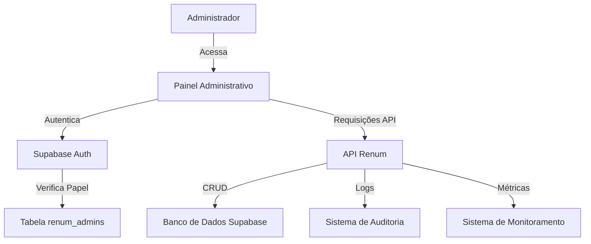
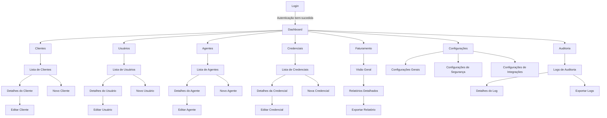

# Documento de Design - Painel Administrativo Renum

## Visão Geral

O Painel Administrativo Renum será uma aplicação web separada, desenvolvida com Next.js, que fornecerá aos administradores do sistema uma interface centralizada para gerenciar todos os aspectos da plataforma Renum. O painel será protegido por autenticação e autorização específicas para administradores, garantindo que apenas usuários autorizados possam acessar as funcionalidades administrativas.

## Arquitetura

### Arquitetura Geral

O Painel Administrativo seguirá uma arquitetura cliente-servidor:

1. **Frontend**: Aplicação Next.js hospedada no Vercel
2. **Backend**: API RESTful existente do Renum com endpoints adicionais específicos para administração
3. **Autenticação**: Supabase Auth com verificação adicional de papel de administrador
4. **Banco de Dados**: Supabase (PostgreSQL) com tabelas específicas para administração



### Integração com Sistema Existente

O Painel Administrativo se integrará ao sistema Renum existente através de:

1. **API Compartilhada**: Utilizará a mesma API do sistema principal, com endpoints adicionais específicos para administração
2. **Banco de Dados Compartilhado**: Acessará as mesmas tabelas do sistema principal, além de tabelas específicas para administração
3. **Autenticação Unificada**: Utilizará o Supabase Auth com verificação adicional de papel de administrador

## Componentes e Interfaces

### Estrutura de Diretórios

```
renum-admin/
├── public/
│   ├── favicon.ico
│   └── logo.svg
├── src/
│   ├── components/
│   │   ├── layout/
│   │   │   ├── Sidebar.tsx
│   │   │   ├── Header.tsx
│   │   │   ├── Footer.tsx
│   │   │   └── Layout.tsx
│   │   ├── dashboard/
│   │   │   ├── MetricsCard.tsx
│   │   │   ├── UsageChart.tsx
│   │   │   └── StatusOverview.tsx
│   │   ├── clients/
│   │   │   ├── ClientList.tsx
│   │   │   ├── ClientDetails.tsx
│   │   │   └── ClientForm.tsx
│   │   ├── users/
│   │   │   ├── UserList.tsx
│   │   │   ├── UserDetails.tsx
│   │   │   └── UserForm.tsx
│   │   ├── agents/
│   │   │   ├── AgentList.tsx
│   │   │   ├── AgentDetails.tsx
│   │   │   └── AgentForm.tsx
│   │   ├── credentials/
│   │   │   ├── CredentialList.tsx
│   │   │   ├── CredentialForm.tsx
│   │   │   └── ApiKeyManager.tsx
│   │   ├── billing/
│   │   │   ├── BillingOverview.tsx
│   │   │   ├── UsageReport.tsx
│   │   │   └── InvoiceList.tsx
│   │   ├── settings/
│   │   │   ├── GeneralSettings.tsx
│   │   │   ├── SecuritySettings.tsx
│   │   │   └── IntegrationSettings.tsx
│   │   ├── audit/
│   │   │   ├── AuditLogList.tsx
│   │   │   └── AuditLogDetails.tsx
│   │   └── ui/
│   │       ├── Button.tsx
│   │       ├── Input.tsx
│   │       ├── Select.tsx
│   │       ├── Table.tsx
│   │       ├── Modal.tsx
│   │       ├── Card.tsx
│   │       ├── Alert.tsx
│   │       └── ... (outros componentes UI)
│   ├── hooks/
│   │   ├── useAuth.ts
│   │   ├── useClients.ts
│   │   ├── useUsers.ts
│   │   ├── useAgents.ts
│   │   ├── useCredentials.ts
│   │   ├── useBilling.ts
│   │   ├── useSettings.ts
│   │   └── useAudit.ts
│   ├── lib/
│   │   ├── api-client.ts
│   │   ├── auth.ts
│   │   ├── store.ts
│   │   └── utils.ts
│   ├── pages/
│   │   ├── _app.tsx
│   │   ├── _document.tsx
│   │   ├── index.tsx (Dashboard)
│   │   ├── login.tsx
│   │   ├── clients/
│   │   │   ├── index.tsx
│   │   │   └── [id].tsx
│   │   ├── users/
│   │   │   ├── index.tsx
│   │   │   └── [id].tsx
│   │   ├── agents/
│   │   │   ├── index.tsx
│   │   │   └── [id].tsx
│   │   ├── credentials/
│   │   │   ├── index.tsx
│   │   │   └── [id].tsx
│   │   ├── billing/
│   │   │   ├── index.tsx
│   │   │   └── reports.tsx
│   │   ├── settings/
│   │   │   ├── index.tsx
│   │   │   ├── security.tsx
│   │   │   └── integrations.tsx
│   │   └── audit/
│   │       ├── index.tsx
│   │       └── [id].tsx
│   ├── styles/
│   │   ├── globals.css
│   │   └── theme.ts
│   └── types/
│       ├── index.d.ts
│       ├── client.ts
│       ├── user.ts
│       ├── agent.ts
│       ├── credential.ts
│       ├── billing.ts
│       ├── setting.ts
│       └── audit.ts
├── .env.local
├── .env.example
├── next.config.js
├── package.json
├── tsconfig.json
└── tailwind.config.js
```

### Componentes Principais

#### Layout

- **Layout.tsx**: Componente principal que envolve todas as páginas, incluindo sidebar, header e footer
- **Sidebar.tsx**: Menu lateral de navegação com links para todas as seções
- **Header.tsx**: Cabeçalho com informações do usuário logado e funcionalidades globais
- **Footer.tsx**: Rodapé com informações de versão e copyright

#### Dashboard

- **MetricsCard.tsx**: Card para exibir métricas individuais com ícone, valor e variação
- **UsageChart.tsx**: Gráfico de uso de recursos ao longo do tempo
- **StatusOverview.tsx**: Visão geral do status dos serviços integrados

#### Gerenciamento de Entidades

Para cada entidade principal (clientes, usuários, agentes, credenciais), teremos:

- **Lista**: Componente de tabela com filtros, paginação e ações
- **Detalhes**: Visualização detalhada de uma entidade específica
- **Formulário**: Formulário para criação e edição de entidades

#### Componentes UI

Componentes reutilizáveis que seguem um design system consistente:

- **Button**: Botão com variantes (primário, secundário, outline, etc.)
- **Input**: Campo de entrada com validação e mensagens de erro
- **Select**: Dropdown para seleção de opções
- **Table**: Tabela com ordenação, paginação e ações
- **Modal**: Janela modal para formulários e confirmações
- **Card**: Container para conteúdo com estilo consistente
- **Alert**: Mensagens de alerta, erro, sucesso e informação

### Fluxos de Navegação



## Modelos de Dados

### Tabelas do Banco de Dados

#### renum_admins

| Campo      | Tipo      | Descrição                                |
|------------|-----------|------------------------------------------|
| id         | UUID      | Identificador único do administrador     |
| user_id    | UUID      | ID do usuário no Supabase Auth           |
| name       | TEXT      | Nome do administrador                    |
| email      | TEXT      | Email do administrador                   |
| role       | TEXT      | Papel do administrador (admin, superadmin)|
| is_active  | BOOLEAN   | Se o administrador está ativo            |
| last_login | TIMESTAMP | Data do último login                     |
| created_at | TIMESTAMP | Data de criação                          |
| updated_at | TIMESTAMP | Data de atualização                      |

#### renum_admin_credentials

| Campo          | Tipo      | Descrição                                |
|----------------|-----------|------------------------------------------|
| id             | UUID      | Identificador único da credencial        |
| admin_id       | UUID      | ID do administrador                      |
| service_name   | TEXT      | Nome do serviço (OpenAI, Anthropic, etc.)|
| credential_type| TEXT      | Tipo de credencial (api_key, oauth, etc.)|
| encrypted_value| TEXT      | Valor criptografado da credencial        |
| is_active      | BOOLEAN   | Se a credencial está ativa               |
| last_used      | TIMESTAMP | Data do último uso                       |
| expires_at     | TIMESTAMP | Data de expiração (opcional)             |
| metadata       | JSONB     | Metadados adicionais                     |
| created_at     | TIMESTAMP | Data de criação                          |
| updated_at     | TIMESTAMP | Data de atualização                      |

#### renum_system_settings

| Campo       | Tipo      | Descrição                                |
|-------------|-----------|------------------------------------------|
| id          | UUID      | Identificador único da configuração      |
| key         | TEXT      | Chave da configuração                    |
| value       | JSONB     | Valor da configuração                    |
| description | TEXT      | Descrição da configuração                |
| is_sensitive| BOOLEAN   | Se a configuração é sensível             |
| updated_by  | UUID      | ID do administrador que atualizou        |
| created_at  | TIMESTAMP | Data de criação                          |
| updated_at  | TIMESTAMP | Data de atualização                      |

#### renum_audit_logs

| Campo       | Tipo      | Descrição                                |
|-------------|-----------|------------------------------------------|
| id          | UUID      | Identificador único do log               |
| event_type  | TEXT      | Tipo de evento                           |
| entity_type | TEXT      | Tipo de entidade (user, client, agent)   |
| entity_id   | UUID      | ID da entidade                           |
| actor_id    | UUID      | ID do usuário que realizou a ação        |
| actor_type  | TEXT      | Tipo de ator (user, admin, system)       |
| details     | JSONB     | Detalhes do evento                       |
| ip_address  | TEXT      | Endereço IP                              |
| user_agent  | TEXT      | User agent do navegador                  |
| created_at  | TIMESTAMP | Data de criação                          |

### Interfaces TypeScript

```typescript
// src/types/admin.ts
export interface Admin {
  id: string;
  user_id: string;
  name: string;
  email: string;
  role: 'admin' | 'superadmin';
  is_active: boolean;
  last_login?: Date;
  created_at: Date;
  updated_at: Date;
}

// src/types/credential.ts
export interface AdminCredential {
  id: string;
  admin_id: string;
  service_name: string;
  credential_type: 'api_key' | 'oauth_token' | 'service_account';
  is_active: boolean;
  last_used?: Date;
  expires_at?: Date;
  metadata: Record<string, any>;
  created_at: Date;
  updated_at: Date;
}

// src/types/setting.ts
export interface SystemSetting {
  id: string;
  key: string;
  value: any;
  description: string;
  is_sensitive: boolean;
  updated_by: string;
  created_at: Date;
  updated_at: Date;
}

// src/types/audit.ts
export interface AuditLog {
  id: string;
  event_type: string;
  entity_type: string;
  entity_id: string;
  actor_id: string;
  actor_type: 'user' | 'admin' | 'system';
  details: Record<string, any>;
  ip_address: string;
  user_agent: string;
  created_at: Date;
}
```

## Tratamento de Erros

### Estratégia de Tratamento de Erros

1. **Erros de API**: Interceptor no cliente de API para tratar erros comuns
   - 401: Redirecionar para login
   - 403: Exibir mensagem de acesso negado
   - 404: Exibir página de recurso não encontrado
   - 500: Exibir mensagem de erro do servidor

2. **Erros de Formulário**: Validação em tempo real com feedback visual
   - Validação no cliente com React Hook Form e Zod
   - Exibição de mensagens de erro específicas por campo
   - Desativação do botão de envio quando o formulário é inválido

3. **Erros de Autenticação**: Tratamento específico para problemas de autenticação
   - Sessão expirada: Redirecionar para login
   - Credenciais inválidas: Exibir mensagem específica
   - Acesso não autorizado: Exibir mensagem e registrar tentativa

4. **Erros de Rede**: Tratamento para problemas de conectividade
   - Retry automático para falhas temporárias
   - Feedback visual para o usuário durante tentativas
   - Armazenamento local de dados não enviados quando possível

### Exemplo de Implementação

```typescript
// src/lib/api-client.ts
import axios from 'axios';
import { toast } from 'react-toastify';

const apiClient = axios.create({
  baseURL: process.env.NEXT_PUBLIC_API_URL,
  headers: {
    'Content-Type': 'application/json',
  },
});

// Interceptor para adicionar token de autenticação
apiClient.interceptors.request.use(async (config) => {
  const token = localStorage.getItem('auth_token');
  if (token) {
    config.headers.Authorization = `Bearer ${token}`;
  }
  return config;
});

// Interceptor para tratamento de erros
apiClient.interceptors.response.use(
  (response) => response,
  (error) => {
    if (error.response) {
      switch (error.response.status) {
        case 401:
          // Redirecionar para login
          window.location.href = '/login';
          break;
        case 403:
          toast.error('Acesso negado. Você não tem permissão para realizar esta ação.');
          break;
        case 404:
          toast.error('Recurso não encontrado.');
          break;
        case 500:
          toast.error('Erro no servidor. Por favor, tente novamente mais tarde.');
          break;
        default:
          toast.error(error.response.data.message || 'Ocorreu um erro. Por favor, tente novamente.');
      }
    } else if (error.request) {
      toast.error('Não foi possível conectar ao servidor. Verifique sua conexão.');
    } else {
      toast.error('Ocorreu um erro ao processar sua solicitação.');
    }
    return Promise.reject(error);
  }
);

export { apiClient };
```

## Estratégia de Testes

### Tipos de Testes

1. **Testes Unitários**
   - Componentes UI isolados
   - Hooks personalizados
   - Funções utilitárias
   - Validadores

2. **Testes de Integração**
   - Fluxos de formulários
   - Interações entre componentes
   - Integração com API (mockada)

3. **Testes End-to-End**
   - Fluxos completos (login, CRUD de entidades)
   - Navegação entre páginas
   - Interações de usuário

### Ferramentas

- **Jest**: Framework de testes
- **React Testing Library**: Testes de componentes React
- **MSW (Mock Service Worker)**: Mockar requisições de API
- **Cypress**: Testes end-to-end

### Exemplo de Teste Unitário

```typescript
// src/components/ui/Button.test.tsx
import { render, screen, fireEvent } from '@testing-library/react';
import Button from './Button';

describe('Button Component', () => {
  test('renders button with text', () => {
    render(<Button>Click me</Button>);
    expect(screen.getByText('Click me')).toBeInTheDocument();
  });

  test('calls onClick when clicked', () => {
    const handleClick = jest.fn();
    render(<Button onClick={handleClick}>Click me</Button>);
    fireEvent.click(screen.getByText('Click me'));
    expect(handleClick).toHaveBeenCalledTimes(1);
  });

  test('shows loading state', () => {
    render(<Button isLoading>Click me</Button>);
    expect(screen.getByRole('status')).toBeInTheDocument();
    expect(screen.getByText('Click me')).toBeInTheDocument();
  });

  test('is disabled when specified', () => {
    render(<Button disabled>Click me</Button>);
    expect(screen.getByText('Click me')).toBeDisabled();
  });
});
```

## Considerações de Segurança

### Autenticação e Autorização

1. **Autenticação Robusta**
   - Utilização do Supabase Auth para autenticação
   - Verificação adicional de papel de administrador
   - Tokens JWT com tempo de expiração curto
   - Refresh tokens para renovação automática

2. **Autorização Granular**
   - Verificação de permissões em cada endpoint da API
   - Diferentes níveis de acesso (admin, superadmin)
   - Políticas RLS no Supabase para proteção em nível de banco de dados

### Proteção de Dados Sensíveis

1. **Criptografia de Credenciais**
   - Criptografia de credenciais antes de armazenar no banco de dados
   - Chaves de criptografia armazenadas em variáveis de ambiente
   - Nunca exibir valores completos de credenciais na interface

2. **Mascaramento de Dados**
   - Mascaramento de informações sensíveis na interface (ex: últimos 4 dígitos)
   - Logs sanitizados para evitar vazamento de informações sensíveis

### Proteção contra Ataques Comuns

1. **CSRF Protection**
   - Tokens CSRF em formulários
   - Validação de origem das requisições

2. **XSS Protection**
   - Sanitização de inputs
   - Content Security Policy (CSP)
   - Uso de React (que escapa HTML por padrão)

3. **Rate Limiting**
   - Limitação de tentativas de login
   - Limitação de requisições por IP
   - Captcha após múltiplas tentativas falhas

## Considerações de UI/UX

### Design System

O painel administrativo seguirá um design system consistente com:

1. **Paleta de Cores**
   - Primária: Tons de azul (#0ea5e9)
   - Secundária: Tons de cinza neutro
   - Alertas: Vermelho (#ef4444), Verde (#10b981), Amarelo (#f59e0b)

2. **Tipografia**
   - Família: Inter (sans-serif)
   - Tamanhos: 14px (texto), 16px (subtítulos), 20px (títulos), 24px+ (cabeçalhos)

3. **Componentes Consistentes**
   - Botões com estados claros (normal, hover, active, disabled)
   - Formulários com validação visual
   - Tabelas com ordenação e paginação
   - Cards para agrupamento de informações relacionadas

### Responsividade

O painel será responsivo, adaptando-se a diferentes tamanhos de tela:

1. **Desktop First**
   - Layout otimizado para telas grandes (administração)
   - Sidebar sempre visível em telas grandes

2. **Adaptação para Tablets**
   - Sidebar colapsável
   - Ajustes de layout para melhor aproveitamento do espaço

3. **Suporte Mínimo para Mobile**
   - Sidebar oculta por padrão (menu hambúrguer)
   - Tabelas com scroll horizontal
   - Formulários em layout de coluna única

### Acessibilidade

O painel seguirá as diretrizes WCAG 2.1 AA:

1. **Semântica HTML**
   - Uso apropriado de elementos HTML5
   - Landmarks para navegação por screen readers

2. **Contraste**
   - Contraste mínimo de 4.5:1 para texto
   - Elementos interativos com contraste adequado

3. **Navegação por Teclado**
   - Todos os elementos interativos acessíveis por teclado
   - Ordem de tabulação lógica
   - Indicadores visuais de foco

4. **Textos Alternativos**
   - Imagens com alt text
   - Ícones com aria-label quando necessário

## Implementação e Deployment

### Tecnologias Principais

1. **Frontend**
   - Next.js 14+
   - React 18+
   - TypeScript
   - TailwindCSS
   - React Query
   - Zustand (gerenciamento de estado)
   - React Hook Form + Zod (formulários e validação)

2. **Backend**
   - API existente do Renum (FastAPI)
   - Endpoints adicionais específicos para administração

3. **Infraestrutura**
   - Vercel para hospedagem do frontend
   - Supabase para banco de dados e autenticação

### Estratégia de Deployment

1. **Ambientes**
   - Desenvolvimento: Vercel Preview Deployments
   - Homologação: Vercel Preview com banco de dados de staging
   - Produção: Vercel Production com banco de dados de produção

2. **CI/CD**
   - GitHub Actions para CI/CD
   - Testes automatizados antes de cada deploy
   - Deploy automático para ambiente de desenvolvimento após merge na branch principal
   - Deploy manual para produção após aprovação

3. **Monitoramento**
   - Sentry para monitoramento de erros
   - Vercel Analytics para métricas de performance
   - Logs estruturados para análise