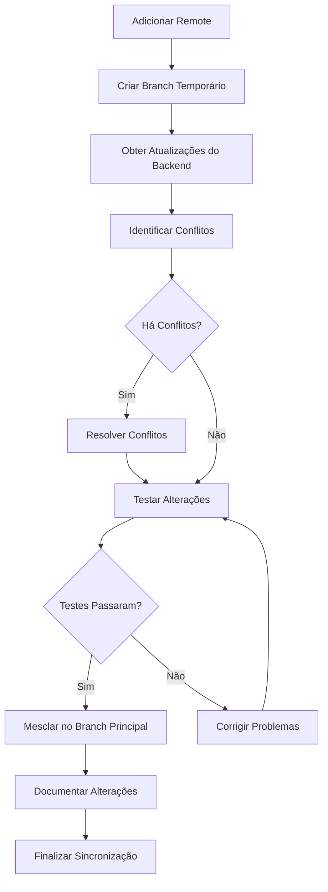

# Design Document

## Overview

Este documento descreve o design do processo de sincronização do diretório `backend` do nosso projeto com o repositório oficial do Suna. O objetivo é obter as atualizações mais recentes do repositório oficial enquanto mantemos a integridade das integrações com o Renum.

## Architecture

O processo de sincronização será baseado em uma abordagem de branch temporário e merge seletivo, seguindo estas etapas principais:

1. Adicionar o repositório oficial como remote
2. Criar um branch temporário para a sincronização
3. Obter as atualizações do diretório backend
4. Identificar e resolver conflitos
5. Testar as alterações
6. Mesclar as alterações no branch principal



## Components and Interfaces

### Componentes do Git

- **Remote Repository**: Repositório oficial do Suna (https://github.com/kortix-ai/suna.git)
- **Local Repository**: Nosso repositório local com as modificações do Renum
- **Branch Temporário**: Branch criado especificamente para a sincronização
- **Branch Principal**: Branch principal do nosso repositório

### Interfaces de Integração

- **Backend do Suna**: Componentes do backend que serão atualizados
- **Integrações Renum-Suna**: Pontos onde o Renum se integra com o backend do Suna
- **Configurações Personalizadas**: Configurações específicas do nosso projeto

## Data Models

### Modelo de Alterações

```json
{
  "file_path": "string",
  "change_type": "added | modified | deleted",
  "conflict": "boolean",
  "resolution": "string | null",
  "impact_on_renum": "none | low | medium | high",
  "notes": "string"
}
```

### Modelo de Relatório de Sincronização

```json
{
  "sync_date": "date",
  "suna_commit": "string",
  "our_commit_before": "string",
  "our_commit_after": "string",
  "files_changed": "number",
  "conflicts_resolved": "number",
  "tests_passed": "boolean",
  "notes": "string"
}
```

## Error Handling

### Estratégias de Tratamento de Erros

1. **Conflitos de Merge**:
   - Documentar cada conflito
   - Analisar o impacto nas integrações com o Renum
   - Resolver priorizando a manutenção das integrações
   - Testar após a resolução

2. **Falhas nos Testes**:
   - Identificar a causa da falha
   - Determinar se é relacionada à sincronização
   - Corrigir o problema
   - Executar os testes novamente

3. **Problemas de Integração**:
   - Identificar os pontos de integração afetados
   - Adaptar o código para manter a compatibilidade
   - Documentar as alterações feitas
   - Testar a integração

4. **Rollback**:
   - Manter um snapshot do estado antes da sincronização
   - Definir critérios claros para decidir quando fazer rollback
   - Documentar o processo de rollback
   - Testar após o rollback

## Testing Strategy

### Testes Pré-Sincronização

1. **Testes de Baseline**:
   - Executar testes existentes para estabelecer uma linha de base
   - Documentar quaisquer falhas existentes
   - Verificar o funcionamento das integrações com o Renum

### Testes Durante a Sincronização

1. **Testes de Conflito**:
   - Testar cada arquivo após a resolução de conflitos
   - Verificar se a funcionalidade original foi mantida

### Testes Pós-Sincronização

1. **Testes de Regressão**:
   - Executar todos os testes existentes
   - Comparar os resultados com a linha de base

2. **Testes de Integração**:
   - Testar especificamente as integrações entre o backend do Suna e o Renum
   - Verificar se todas as funcionalidades estão operando corretamente

3. **Testes de Sistema**:
   - Executar testes que simulam o uso real do sistema
   - Verificar se não há problemas de desempenho ou comportamento inesperado