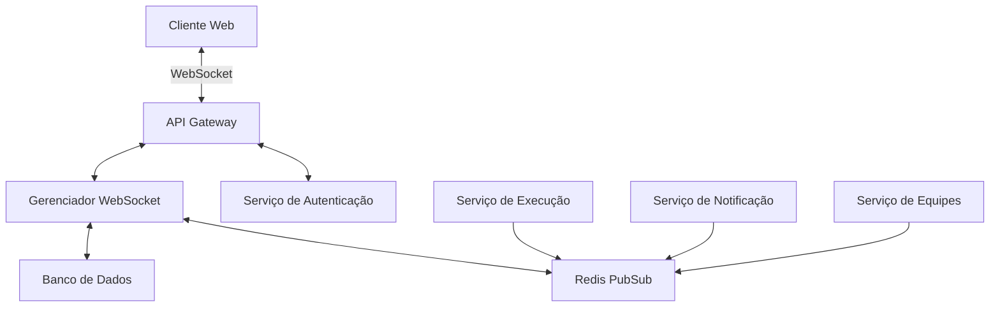

# Documento de Design - Integração WebSocket

## Visão Geral

Este documento descreve o design técnico para a implementação da integração WebSocket na plataforma Renum. A solução proposta permitirá comunicação bidirecional em tempo real entre o frontend e o backend, possibilitando atualizações instantâneas de dados, notificações e monitoramento de execuções de equipes de agentes.

## Arquitetura

### Diagrama de Arquitetura



### Componentes Principais

1. **Cliente Web**
   - Implementação WebSocket no frontend usando Socket.IO client
   - Gerenciamento de conexão e reconexão automática
   - Manipuladores de eventos para diferentes tipos de mensagens

2. **API Gateway**
   - Ponto de entrada para conexões WebSocket
   - Validação de autenticação e autorização
   - Roteamento de mensagens para os serviços apropriados

3. **Gerenciador WebSocket**
   - Gerenciamento de conexões ativas
   - Mapeamento de usuários para conexões
   - Implementação de canais e salas para segmentação de mensagens

4. **Redis PubSub**
   - Sistema de mensagens pub/sub para comunicação entre serviços
   - Armazenamento temporário de mensagens para clientes desconectados
   - Escalabilidade horizontal para suportar múltiplas instâncias

5. **Serviços de Backend**
   - Integração com o sistema de execução de equipes
   - Geração de eventos para notificações
   - Processamento de comandos recebidos via WebSocket

## Componentes e Interfaces

### Backend (FastAPI)

#### WebSocketManager

```python
class WebSocketManager:
    async def connect(self, websocket: WebSocket, user_id: str) -> None:
        # Estabelece conexão e registra o cliente
    
    async def disconnect(self, websocket: WebSocket, user_id: str) -> None:
        # Gerencia desconexão do cliente
    
    async def send_personal_message(self, message: dict, user_id: str) -> None:
        # Envia mensagem para um usuário específico
    
    async def broadcast(self, message: dict, exclude: Optional[List[str]] = None) -> None:
        # Envia mensagem para todos os usuários conectados
    
    async def subscribe(self, user_id: str, channel: str) -> None:
        # Inscreve usuário em um canal específico
    
    async def publish_to_channel(self, channel: str, message: dict) -> None:
        # Publica mensagem em um canal específico
```

#### WebSocketEndpoint

```python
@app.websocket("/ws/{token}")
async def websocket_endpoint(websocket: WebSocket, token: str):
    # Validação de token JWT
    # Estabelecimento de conexão
    # Loop de recebimento de mensagens
    # Tratamento de desconexões
```

#### NotificationService

```python
class NotificationService:
    async def create_notification(self, user_id: str, notification_type: str, content: dict) -> None:
        # Cria notificação no banco de dados
        # Publica evento no Redis para entrega em tempo real
    
    async def mark_as_read(self, notification_id: str) -> None:
        # Marca notificação como lida
    
    async def get_unread_notifications(self, user_id: str) -> List[Notification]:
        # Recupera notificações não lidas para um usuário
```

### Frontend (Next.js)

#### WebSocketService

```typescript
class WebSocketService {
  private socket: Socket;
  private reconnectAttempts: number = 0;
  
  constructor() {
    // Inicialização do Socket.IO client
  }
  
  connect(token: string): void {
    // Estabelece conexão com o servidor WebSocket
    // Configura handlers de eventos
  }
  
  disconnect(): void {
    // Desconecta do servidor WebSocket
  }
  
  subscribe(channel: string, callback: (data: any) => void): () => void {
    // Inscreve em um canal específico
    // Retorna função para cancelar inscrição
  }
  
  send(event: string, data: any): void {
    // Envia mensagem para o servidor
  }
  
  onReconnect(callback: () => void): void {
    // Configura callback para reconexão
  }
}
```

#### WebSocketProvider

```typescript
const WebSocketContext = createContext<WebSocketService | null>(null);

export const WebSocketProvider: React.FC = ({ children }) => {
  const [service] = useState(() => new WebSocketService());
  const { user } = useAuth();
  
  useEffect(() => {
    if (user) {
      service.connect(user.token);
      return () => service.disconnect();
    }
  }, [user, service]);
  
  return (
    <WebSocketContext.Provider value={service}>
      {children}
    </WebSocketContext.Provider>
  );
};

export const useWebSocket = () => useContext(WebSocketContext);
```

#### NotificationComponent

```typescript
const NotificationComponent: React.FC = () => {
  const [notifications, setNotifications] = useState<Notification[]>([]);
  const [unreadCount, setUnreadCount] = useState(0);
  const webSocket = useWebSocket();
  
  useEffect(() => {
    // Carrega notificações iniciais
    // Inscreve para receber novas notificações
    
    const unsubscribe = webSocket?.subscribe('notifications', (data) => {
      // Atualiza lista de notificações
      // Incrementa contador de não lidas
    });
    
    return () => {
      if (unsubscribe) unsubscribe();
    };
  }, [webSocket]);
  
  // Renderização do componente
};
```

## Modelos de Dados

### Conexão WebSocket

```typescript
interface WebSocketConnection {
  id: string;
  user_id: string;
  connected_at: Date;
  last_activity: Date;
  subscribed_channels: string[];
  client_info: {
    ip: string;
    user_agent: string;
    client_id: string;
  };
}
```

### Mensagem WebSocket

```typescript
interface WebSocketMessage {
  type: 'notification' | 'execution_update' | 'system_event' | 'command';
  payload: any;
  timestamp: Date;
  channel?: string;
  sender?: string;
  target?: string | string[];
}
```

### Notificação

```typescript
interface Notification {
  id: string;
  user_id: string;
  type: 'info' | 'success' | 'warning' | 'error';
  title: string;
  message: string;
  read: boolean;
  created_at: Date;
  action?: {
    type: string;
    payload: any;
  };
}
```

### Atualização de Execução

```typescript
interface ExecutionUpdate {
  execution_id: string;
  team_id: string;
  status: 'queued' | 'running' | 'completed' | 'failed';
  progress: number;
  current_step?: string;
  result?: any;
  error?: string;
  updated_at: Date;
}
```

## Tratamento de Erros

### Estratégias de Reconexão

1. **Reconexão Exponencial**
   - Tentativas iniciais com intervalos curtos (1s, 2s, 4s, 8s, etc.)
   - Limite máximo de 5 tentativas antes de solicitar intervenção do usuário
   - Notificação visual do estado de conexão na interface

2. **Tratamento de Desconexões**
   - Armazenamento temporário de mensagens não entregues
   - Sincronização de estado após reconexão
   - Mecanismo de heartbeat para detectar conexões zumbi

### Cenários de Erro

1. **Falha de Autenticação**
   - Redirecionamento para página de login
   - Mensagem clara sobre o motivo da falha

2. **Timeout de Conexão**
   - Fallback para polling em caso de falha persistente
   - Indicador visual de modo degradado

3. **Sobrecarga do Servidor**
   - Implementação de circuit breaker
   - Limitação de taxa de mensagens por cliente
   - Priorização de mensagens críticas

## Estratégia de Teste

### Testes Unitários

1. **Backend**
   - Testes para WebSocketManager
   - Testes para serviço de notificações
   - Testes para validação de mensagens

2. **Frontend**
   - Testes para WebSocketService
   - Testes para componentes que consomem WebSocket
   - Testes para manipuladores de eventos

### Testes de Integração

1. **Comunicação Backend-Frontend**
   - Verificação de entrega de mensagens
   - Teste de reconexão automática
   - Validação de autenticação

2. **Integração com Outros Serviços**
   - Teste de publicação de eventos de execução
   - Teste de entrega de notificações
   - Teste de broadcast para múltiplos clientes

### Testes de Carga

1. **Simulação de Múltiplos Clientes**
   - Teste com 100+ conexões simultâneas
   - Medição de latência sob carga
   - Verificação de uso de recursos do servidor

2. **Cenários de Falha**
   - Teste de recuperação após queda do servidor
   - Teste de comportamento com perda de conexão
   - Teste de limite de reconexões

## Considerações de Segurança

1. **Autenticação**
   - Validação de tokens JWT para cada conexão
   - Renovação segura de tokens expirados
   - Proteção contra replay attacks

2. **Autorização**
   - Verificação de permissões para canais específicos
   - Isolamento de mensagens entre usuários
   - Validação de origem de comandos

3. **Proteção contra Ataques**
   - Limitação de taxa por IP e por usuário
   - Validação de formato e tamanho de mensagens
   - Monitoramento de padrões suspeitos de conexão

## Estratégia de Implantação

1. **Fase 1: Infraestrutura Base**
   - Implementação do WebSocketManager
   - Configuração do Redis PubSub
   - Testes de carga iniciais

2. **Fase 2: Integração com Execuções**
   - Implementação de atualizações em tempo real para execuções
   - Testes com usuários internos
   - Ajustes de desempenho

3. **Fase 3: Sistema de Notificações**
   - Implementação completa de notificações
   - Interface de usuário para gerenciamento de notificações
   - Testes de aceitação do usuário

4. **Fase 4: Recursos Avançados**
   - Implementação de canais personalizados
   - Painel administrativo para monitoramento
   - Otimizações finais