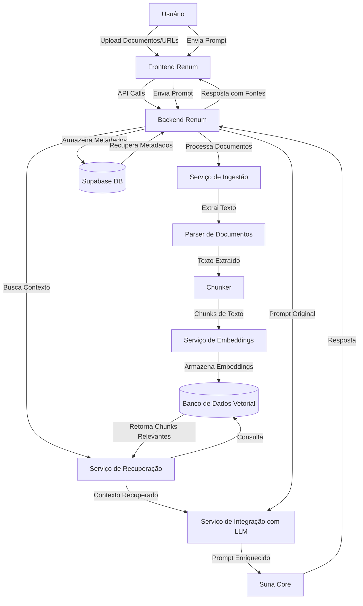
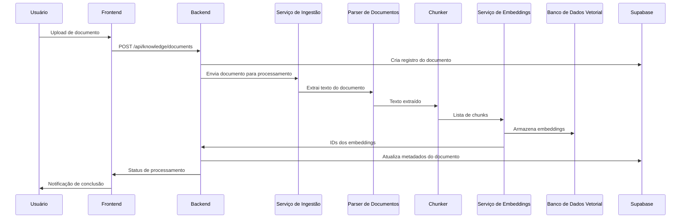

# Design do Módulo RAG (Retrieval-Augmented Generation)

## Visão Geral

O módulo RAG (Retrieval-Augmented Generation) é um componente central da Plataforma Renum que permite enriquecer as respostas dos agentes com informações específicas provenientes de bases de conhecimento personalizadas. Este documento detalha a arquitetura técnica, os componentes e as interfaces necessárias para implementar os requisitos definidos.

## Arquitetura

O módulo RAG segue uma arquitetura de microserviços, integrada ao backend da Plataforma Renum e ao sistema Suna Core. A arquitetura é composta por quatro componentes principais:

1. **Serviço de Ingestão**: Responsável por processar documentos e URLs, extrair conteúdo e preparar para indexação.
2. **Serviço de Embeddings**: Converte texto em representações vetoriais e gerencia o banco de dados vetorial.
3. **Serviço de Recuperação**: Busca informações relevantes com base em consultas.
4. **Serviço de Integração com LLM**: Incorpora as informações recuperadas nos prompts enviados ao LLM.

### Diagrama de Arquitetura


##
 Componentes e Interfaces

### 1. Serviço de Ingestão

#### Responsabilidades:
- Processar documentos em diferentes formatos (PDF, DOCX, TXT, HTML, Markdown)
- Extrair conteúdo de URLs
- Limpar e normalizar o texto
- Dividir o conteúdo em chunks
- Gerenciar filas de processamento para operações assíncronas

#### Interfaces:

```python
class DocumentProcessor:
    async def process_document(self, file_content: bytes, file_name: str, mime_type: str, collection_id: str) -> str:
        """
        Processa um documento e retorna um ID de processamento.
        """
        pass
        
    async def get_processing_status(self, processing_id: str) -> Dict:
        """
        Retorna o status de um processamento.
        """
        pass

class URLProcessor:
    async def process_url(self, url: str, collection_id: str) -> str:
        """
        Processa uma URL e retorna um ID de processamento.
        """
        pass
        
    async def get_processing_status(self, processing_id: str) -> Dict:
        """
        Retorna o status de um processamento.
        """
        pass

class TextChunker:
    def chunk_text(self, text: str, chunk_size: int = 1000, chunk_overlap: int = 200) -> List[str]:
        """
        Divide o texto em chunks com sobreposição.
        """
        pass
```

### 2. Serviço de Embeddings

#### Responsabilidades:
- Gerar embeddings para chunks de texto
- Armazenar embeddings no banco de dados vetorial
- Gerenciar o ciclo de vida dos embeddings (atualização, exclusão)
- Otimizar o armazenamento e recuperação de embeddings

#### Interfaces:

```python
class EmbeddingService:
    async def create_embeddings(self, chunks: List[Dict], document_id: str) -> List[str]:
        """
        Cria embeddings para uma lista de chunks e retorna os IDs dos embeddings.
        """
        pass
        
    async def delete_embeddings(self, document_id: str) -> bool:
        """
        Exclui todos os embeddings associados a um documento.
        """
        pass
        
    async def update_embeddings(self, document_id: str, chunks: List[Dict]) -> List[str]:
        """
        Atualiza os embeddings de um documento.
        """
        pass
```

### 3. Serviço de Recuperação

#### Responsabilidades:
- Buscar chunks relevantes com base em consultas
- Implementar algoritmos de similaridade semântica
- Otimizar a performance de busca
- Implementar estratégias de caching

#### Interfaces:

```python
class RetrievalService:
    async def retrieve_relevant_chunks(self, query: str, collection_ids: List[str], top_k: int = 5) -> List[Dict]:
        """
        Recupera os chunks mais relevantes para uma consulta.
        """
        pass
        
    async def retrieve_by_filters(self, filters: Dict, collection_ids: List[str], top_k: int = 5) -> List[Dict]:
        """
        Recupera chunks com base em filtros específicos.
        """
        pass
```

### 4. Serviço de Integração com LLM

#### Responsabilidades:
- Incorporar chunks recuperados nos prompts enviados ao LLM
- Formatar o contexto de forma otimizada para o LLM
- Rastrear quais fontes foram utilizadas
- Gerenciar o tamanho do contexto para evitar exceder limites do LLM

#### Interfaces:

```python
class LLMIntegrationService:
    async def enrich_prompt(self, original_prompt: str, relevant_chunks: List[Dict]) -> str:
        """
        Enriquece o prompt original com chunks relevantes.
        """
        pass
        
    async def format_response_with_sources(self, response: str, used_chunks: List[Dict]) -> Dict:
        """
        Formata a resposta incluindo as fontes utilizadas.
        """
        pass
```#
# Modelo de Dados

### Tabelas no Supabase

#### 1. knowledge_bases

| Coluna | Tipo | Descrição |
|--------|------|-----------|
| id | uuid | Identificador único da base de conhecimento |
| name | text | Nome da base de conhecimento |
| description | text | Descrição opcional |
| client_id | uuid | ID do cliente proprietário |
| created_at | timestamp | Data de criação |
| updated_at | timestamp | Data da última atualização |

#### 2. knowledge_collections

| Coluna | Tipo | Descrição |
|--------|------|-----------|
| id | uuid | Identificador único da coleção |
| knowledge_base_id | uuid | ID da base de conhecimento |
| name | text | Nome da coleção |
| description | text | Descrição opcional |
| created_at | timestamp | Data de criação |
| updated_at | timestamp | Data da última atualização |

#### 3. documents

| Coluna | Tipo | Descrição |
|--------|------|-----------|
| id | uuid | Identificador único do documento |
| collection_id | uuid | ID da coleção |
| name | text | Nome do documento |
| source_type | text | Tipo de fonte (file, url, text) |
| source_url | text | URL de origem (se aplicável) |
| file_type | text | Tipo de arquivo (pdf, docx, etc.) |
| file_size | integer | Tamanho do arquivo em bytes |
| status | text | Status do processamento |
| created_at | timestamp | Data de criação |
| updated_at | timestamp | Data da última atualização |

#### 4. document_chunks

| Coluna | Tipo | Descrição |
|--------|------|-----------|
| id | uuid | Identificador único do chunk |
| document_id | uuid | ID do documento |
| content | text | Conteúdo do chunk |
| chunk_index | integer | Índice do chunk no documento |
| metadata | jsonb | Metadados adicionais |
| embedding_id | text | ID do embedding no banco vetorial |
| created_at | timestamp | Data de criação |

#### 5. conversation_history

| Coluna | Tipo | Descrição |
|--------|------|-----------|
| id | uuid | Identificador único da mensagem |
| thread_id | uuid | ID da thread de conversa |
| agent_id | uuid | ID do agente |
| user_id | uuid | ID do usuário |
| message | text | Conteúdo da mensagem |
| role | text | Papel (user, assistant) |
| used_chunks | jsonb | IDs dos chunks utilizados |
| created_at | timestamp | Data de criação |

### Banco de Dados Vetorial

Para o armazenamento de embeddings, utilizaremos o Supabase Vector ou uma alternativa como Chroma, dependendo dos requisitos de performance e escala. A estrutura básica incluirá:

- **Embeddings**: Vetores de alta dimensionalidade representando chunks de texto
- **Metadados**: Informações associadas a cada embedding (document_id, chunk_id, etc.)
- **Índices**: Estruturas otimizadas para busca por similaridade## 
Fluxos de Trabalho

### 1. Ingestão de Documentos



### 2. Recuperação e Geração de Resposta

```mermaid
sequenceDiagram
    participant User as Usuário
    participant Frontend
    participant Backend
    participant Retrieval as Serviço de Recuperação
    participant VectorDB as Banco de Dados Vetorial
    participant LLMIntegration as Serviço de Integração com LLM
    participant SunaCore
    participant Supabase
    
    User->>Frontend: Envia pergunta
    Frontend->>Backend: POST /api/agents/{agent_id}/chat
    Backend->>Retrieval: Busca contexto relevante
    Retrieval->>VectorDB: Consulta por similaridade
    VectorDB->>Retrieval: Chunks relevantes
    Retrieval->>LLMIntegration: Chunks relevantes
    Backend->>LLMIntegration: Prompt original
    LLMIntegration->>SunaCore: Prompt enriquecido
    SunaCore->>LLMIntegration: Resposta
    LLMIntegration->>Backend: Resposta com fontes
    Backend->>Supabase: Registra conversa e fontes
    Backend->>Frontend: Resposta formatada
    Frontend->>User: Exibe resposta com fontes
```## Estr
atégias de Implementação

### Processamento de Documentos

Para o processamento de documentos, utilizaremos bibliotecas específicas para cada formato:

- **PDF**: PyPDF2 ou pdf2text
- **DOCX**: python-docx
- **HTML**: BeautifulSoup ou Trafilatura
- **Markdown**: markdown-it-py

O processamento será assíncrono, utilizando filas de tarefas para lidar com documentos grandes ou múltiplos uploads simultâneos.

### Geração de Embeddings

Para a geração de embeddings, utilizaremos modelos pré-treinados como:

- OpenAI Ada 2
- Sentence Transformers (para opção self-hosted)
- Hugging Face Embeddings

A escolha do modelo dependerá de requisitos de performance, custo e privacidade.

### Banco de Dados Vetorial

Opções para o banco de dados vetorial:

1. **Supabase Vector**: Integração nativa com o Supabase, facilidade de uso
2. **Chroma**: Solução especializada para RAG, boa performance
3. **Pinecone**: Serviço gerenciado, alta escalabilidade
4. **Weaviate**: Recursos avançados de filtragem e busca híbrida

A implementação inicial utilizará Supabase Vector pela integração nativa com o restante da plataforma.

### Estratégias de Chunking

O chunking será implementado com as seguintes estratégias:

1. **Chunking por tamanho fixo**: Dividir o texto em chunks de tamanho fixo (ex: 1000 caracteres)
2. **Chunking por parágrafos**: Respeitar a estrutura natural do documento
3. **Chunking semântico**: Utilizar modelos para identificar unidades semânticas coerentes

Cada estratégia será aplicada dependendo do tipo e estrutura do documento.

### Otimização de Performance

Para garantir performance mesmo com grandes volumes de dados:

1. **Indexação otimizada**: Utilizar índices HNSW ou IVF para busca eficiente
2. **Caching**: Implementar cache para consultas frequentes
3. **Processamento em lote**: Processar documentos em lotes para otimizar recursos
4. **Compressão de embeddings**: Reduzir dimensionalidade quando apropriado## Consi
derações de Segurança

1. **Isolamento de dados**: Garantir que dados de um cliente não sejam acessíveis por outros
2. **Criptografia**: Implementar criptografia para documentos sensíveis
3. **Controle de acesso**: Utilizar Row Level Security (RLS) do Supabase
4. **Auditoria**: Registrar todas as operações de acesso e modificação
5. **Sanitização**: Remover conteúdo potencialmente malicioso antes do processamento

## Métricas e Monitoramento

O módulo RAG será monitorado através das seguintes métricas:

1. **Tempo de processamento**: Tempo médio para processar documentos
2. **Tempo de recuperação**: Latência das consultas de recuperação
3. **Relevância**: Qualidade dos chunks recuperados (via feedback do usuário)
4. **Uso de recursos**: Consumo de CPU, memória e armazenamento
5. **Taxa de utilização**: Frequência com que cada documento é utilizado

## Integração com o Restante da Plataforma

### Integração com o Frontend

O frontend da Renum incluirá:

1. **Interface de upload**: Para documentos e URLs
2. **Gerenciador de coleções**: Para organizar bases de conhecimento
3. **Visualizador de documentos**: Para revisar e editar documentos
4. **Dashboard de métricas**: Para visualizar estatísticas de uso
5. **Configuração de agentes**: Para associar bases de conhecimento a agentes

### Integração com o Suna Core

A integração com o Suna Core será feita através do Backend da Renum, que:

1. Enriquecerá os prompts com contexto relevante antes de enviá-los ao Suna
2. Processará as respostas do Suna para incluir referências às fontes
3. Rastreará quais documentos foram utilizados em cada interação

## Plano de Testes

1. **Testes unitários**: Para cada componente do módulo RAG
2. **Testes de integração**: Para verificar a interação entre componentes
3. **Testes de performance**: Para garantir escalabilidade e eficiência
4. **Testes de segurança**: Para verificar isolamento e controle de acesso
5. **Testes de usuário**: Para validar a usabilidade das interfaces

## Limitações e Considerações Futuras

1. **Escalabilidade**: O sistema inicial será otimizado para bases de conhecimento de tamanho médio. Futuras versões poderão implementar estratégias adicionais para bases muito grandes.
2. **Multilinguagem**: A versão inicial focará em conteúdo em português e inglês. Suporte a outros idiomas será adicionado posteriormente.
3. **Formatos avançados**: Suporte para formatos como apresentações, planilhas e imagens com texto será implementado em versões futuras.
4. **Aprendizado contínuo**: Mecanismos para refinar a base de conhecimento com base no feedback do usuário serão desenvolvidos em versões posteriores.##
 Atualizações e Esclarecimentos

### Serviço de Scraping para URLs

Para o processamento de URLs, utilizaremos o Firecrawl como serviço principal de scraping, aproveitando a integração já existente com a Suna. O fluxo de processamento será:

1. O usuário submete uma URL
2. O Backend da Renum envia a URL para o Firecrawl via API
3. O Firecrawl extrai o conteúdo HTML e o converte para texto limpo
4. O texto extraído é processado pelo pipeline de chunking e embedding

```python
class URLProcessor:
    async def process_url(self, url: str, collection_id: str) -> str:
        """
        Processa uma URL usando o Firecrawl e retorna um ID de processamento.
        """
        # Obter credenciais do Firecrawl
        firecrawl_api_key = await self.credential_manager.get_api_key("firecrawl")
        
        # Chamar Firecrawl API
        response = await self.firecrawl_client.extract_content(url, api_key=firecrawl_api_key)
        
        # Processar o conteúdo extraído
        content = response.get("content")
        
        # Continuar com o pipeline de processamento...
        pass
```

### Versionamento de Documentos

Para atender ao requisito R5 sobre edição e histórico de documentos, adicionaremos uma tabela específica para rastrear versões:

#### Tabela: document_versions

| Coluna | Tipo | Descrição |
|--------|------|-----------|
| id | uuid | Identificador único da versão |
| document_id | uuid | ID do documento |
| version_number | integer | Número sequencial da versão |
| change_type | text | Tipo de alteração (create, update, delete) |
| changed_by | uuid | ID do usuário que fez a alteração |
| change_description | text | Descrição opcional da alteração |
| created_at | timestamp | Data da criação da versão |

O fluxo de atualização de documentos será:

1. Quando um documento é atualizado, a versão atual é preservada na tabela `document_versions`
2. O documento na tabela `documents` é atualizado com o novo conteúdo
3. Os chunks antigos são marcados como obsoletos, mas mantidos para referência histórica
4. Novos chunks são gerados e novos embeddings são criados
5. A interface de usuário permite visualizar e restaurar versões anteriores

### Captura de Feedback de Relevância

Para implementar o feedback de relevância mencionado nas métricas, adicionaremos:

#### Tabela: retrieval_feedback

| Coluna | Tipo | Descrição |
|--------|------|-----------|
| id | uuid | Identificador único do feedback |
| thread_id | uuid | ID da thread de conversa |
| message_id | uuid | ID da mensagem do assistente |
| chunk_id | uuid | ID do chunk avaliado |
| relevance_score | integer | Pontuação de relevância (1-5) |
| user_id | uuid | ID do usuário que deu o feedback |
| feedback_text | text | Comentário opcional |
| created_at | timestamp | Data do feedback |

Endpoints adicionais:

```
POST /api/feedback/relevance
{
  "message_id": "uuid",
  "chunk_id": "uuid",
  "relevance_score": 4,
  "feedback_text": "Esta informação foi útil, mas não completamente precisa"
}
```

A interface do usuário incluirá botões de feedback (útil/não útil) ao lado de cada fonte citada nas respostas.

### Métricas de Uso de Documentos

Para rastrear o uso de documentos e chunks, adicionaremos:

#### Tabela: document_usage_stats

| Coluna | Tipo | Descrição |
|--------|------|-----------|
| id | uuid | Identificador único |
| document_id | uuid | ID do documento |
| chunk_id | uuid | ID do chunk (opcional) |
| agent_id | uuid | ID do agente que usou o documento |
| client_id | uuid | ID do cliente |
| usage_count | integer | Contador de uso |
| last_used_at | timestamp | Data do último uso |
| first_used_at | timestamp | Data do primeiro uso |

Esta tabela será atualizada sempre que um documento ou chunk for utilizado em uma resposta, permitindo análises detalhadas de uso.

### Limites de Uso por Plano

Para suportar diferentes planos de assinatura e limites de uso, adicionaremos:

#### Tabela: client_plans

| Coluna | Tipo | Descrição |
|--------|------|-----------|
| id | uuid | Identificador único |
| client_id | uuid | ID do cliente |
| plan_type | text | Tipo de plano (free, basic, premium, enterprise) |
| max_documents | integer | Número máximo de documentos permitidos |
| max_storage_mb | integer | Armazenamento máximo em MB |
| max_queries_per_day | integer | Número máximo de consultas por dia |
| current_usage | jsonb | Uso atual (documentos, armazenamento, consultas) |
| plan_start_date | timestamp | Data de início do plano |
| plan_end_date | timestamp | Data de término do plano |

O sistema verificará esses limites antes de permitir uploads de novos documentos ou consultas à base de conhecimento.