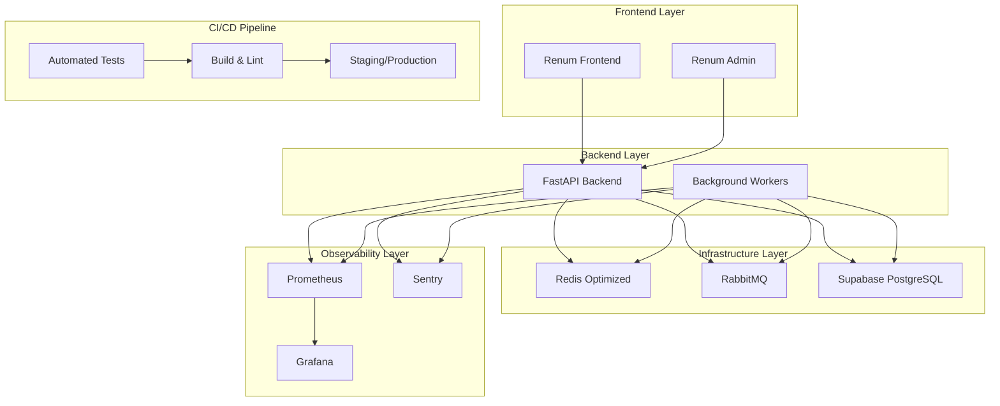

# Design Document

## Overview

Este documento apresenta o design técnico para a correção holística do sistema Suna-Core e Renum. A solução aborda de forma integrada os problemas identificados na auditoria: padronização de dependências, otimização de infraestrutura, segurança de banco de dados, observabilidade, sincronização de frontend, testes automatizados, documentação e pipeline CI/CD.

A abordagem é incremental e não-disruptiva, permitindo que o sistema continue operando durante as correções, com validação em cada etapa.

## Architecture

### Arquitetura Atual vs. Proposta

**Atual:**
- Dependências mistas e desatualizadas
- Configuração básica de infraestrutura
- Falta de observabilidade
- Testes limitados
- Documentação dispersa

**Proposta:**
- Stack padronizado e atualizado
- Infraestrutura otimizada para produção
- Observabilidade completa (Prometheus + Grafana + Sentry)
- Cobertura de testes >= 80%
- Documentação centralizada com MkDocs
- Pipeline CI/CD automatizado

### Componentes Principais



## Components and Interfaces

### 1. Dependency Management System

**Componente:** Unified Dependency Manager
- **Responsabilidade:** Gerenciar versões padronizadas de todas as dependências
- **Interface:** 
  - `pyproject.toml` centralizado para backend
  - `package.json` sincronizado para frontends
- **Implementação:**
  - Migração de `aioredis` para `redis.asyncio`
  - Atualização para FastAPI 0.115.12+
  - Supabase 2.17.0+
  - PyJWT 2.10.1+

### 2. Infrastructure Optimization Layer

**Componente:** Production-Ready Infrastructure
- **Responsabilidade:** Configurar infraestrutura otimizada para produção
- **Interface:**
  - Redis configurado com `redis.conf` otimizado
  - Docker Compose com limites de recursos
  - Multi-worker FastAPI setup
- **Configurações:**
  ```yaml
  # Redis Configuration
  maxmemory: 2gb
  maxmemory-policy: allkeys-lru
  appendonly: yes
  requirepass: secure_password
  
  # Docker Resources
  deploy:
    resources:
      limits:
        cpus: '2.0'
        memory: 4G
  ```

### 3. Database Security Layer

**Componente:** Secure Database Manager
- **Responsabilidade:** Padronizar nomenclatura e implementar segurança
- **Interface:**
  - Migration scripts para renomear tabelas
  - RLS policies para todas as tabelas
  - Basejump integration para controle de acesso
- **Padrões:**
  - Prefixo `renum_` para todas as tabelas
  - RLS ativo por padrão
  - Auditoria de acesso implementada

### 4. Observability Stack

**Componente:** Comprehensive Monitoring System
- **Responsabilidade:** Monitoramento completo do sistema
- **Interface:**
  - Prometheus metrics endpoint `/metrics`
  - Grafana dashboards
  - Sentry error tracking
- **Métricas Coletadas:**
  - HTTP requests (count, duration, status)
  - Database queries (count, duration)
  - Redis operations (hits, misses, latency)
  - Worker tasks (processed, failed, duration)

### 5. Frontend Synchronization Layer

**Componente:** Unified Frontend Dependencies
- **Responsabilidade:** Sincronizar dependências entre renum-frontend e renum-admin
- **Interface:**
  - Shared dependency configuration
  - Build optimization scripts
  - Performance monitoring
- **Otimizações:**
  - Code splitting automático
  - Lazy loading de componentes
  - Compressão de imagens
  - Bundle size monitoring

### 6. Testing Framework

**Componente:** Comprehensive Test Suite
- **Responsabilidade:** Garantir qualidade e confiabilidade do código
- **Interface:**
  - Backend: pytest com cobertura >= 80%
  - Frontend: Jest + React Testing Library
  - Integration tests para APIs críticas
- **Estrutura:**
  ```
  tests/
  ├── backend/
  │   ├── unit/
  │   ├── integration/
  │   └── e2e/
  └── frontend/
      ├── components/
      ├── pages/
      └── utils/
  ```

### 7. Documentation System

**Componente:** Centralized Documentation
- **Responsabilidade:** Manter documentação técnica atualizada
- **Interface:**
  - MkDocs com estrutura padronizada
  - Auto-generated API docs
  - Deployment guides
- **Estrutura:**
  ```
  docs/
  ├── index.md
  ├── backend/
  ├── frontend/
  ├── infrastructure/
  └── deployment/
  ```

### 8. CI/CD Pipeline

**Componente:** Automated Deployment Pipeline
- **Responsabilidade:** Automatizar testes, build e deploy
- **Interface:**
  - GitHub Actions workflows
  - Staging environment validation
  - Production deployment controls
- **Stages:**
  1. Code quality checks (lint, format)
  2. Automated tests (unit, integration)
  3. Build validation
  4. Staging deployment
  5. Manual production approval
  6. Production deployment
  7. Health checks

## Data Models

### Configuration Models

```python
# Infrastructure Configuration
@dataclass
class RedisConfig:
    host: str
    port: int
    password: str
    max_memory: str
    policy: str

@dataclass
class DatabaseConfig:
    url: str
    table_prefix: str = "renum_"
    rls_enabled: bool = True

# Monitoring Configuration
@dataclass
class MetricsConfig:
    prometheus_port: int = 9090
    grafana_port: int = 3000
    sentry_dsn: str
```

### Migration Models

```python
# Database Migration
@dataclass
class TableMigration:
    old_name: str
    new_name: str
    migration_sql: str
    rollback_sql: str

# Dependency Migration
@dataclass
class DependencyMigration:
    package_name: str
    old_version: str
    new_version: str
    breaking_changes: List[str]
```

## Error Handling

### Error Categories

1. **Migration Errors**
   - Dependency conflicts
   - Database migration failures
   - Configuration errors

2. **Runtime Errors**
   - Redis connection failures
   - Database timeout errors
   - Worker task failures

3. **Monitoring Errors**
   - Metrics collection failures
   - Alert system failures
   - Dashboard rendering errors

### Error Handling Strategy

```python
class SystemFixError(Exception):
    """Base exception for system fixes"""
    pass

class MigrationError(SystemFixError):
    """Raised when migration fails"""
    def __init__(self, component: str, details: str):
        self.component = component
        self.details = details
        super().__init__(f"Migration failed for {component}: {details}")

class ValidationError(SystemFixError):
    """Raised when validation fails"""
    pass

# Error Recovery
async def handle_migration_error(error: MigrationError):
    logger.error(f"Migration error: {error}")
    await rollback_migration(error.component)
    await notify_team(error)
```

### Rollback Mechanisms

- **Database:** Automated rollback scripts para cada migração
- **Dependencies:** Version pinning e rollback automático
- **Configuration:** Backup automático de configurações
- **Infrastructure:** Blue-green deployment para rollback rápido

## Testing Strategy

### Test Pyramid

```
    /\
   /  \     E2E Tests (10%)
  /____\    - Full system integration
 /      \   - Critical user journeys
/________\  
           Integration Tests (20%)
           - API endpoints
           - Database operations
           - Redis operations
           
           Unit Tests (70%)
           - Business logic
           - Utility functions
           - Component behavior
```

### Test Implementation

**Backend Testing:**
```python
# Unit Tests
@pytest.mark.asyncio
async def test_redis_connection():
    redis_client = await get_redis_client()
    assert await redis_client.ping()

# Integration Tests
@pytest.mark.asyncio
async def test_api_endpoint_with_auth():
    response = await client.get("/api/users", headers=auth_headers)
    assert response.status_code == 200

# Performance Tests
@pytest.mark.performance
async def test_api_response_time():
    start_time = time.time()
    response = await client.get("/api/health")
    duration = time.time() - start_time
    assert duration < 0.1  # 100ms max
```

**Frontend Testing:**
```javascript
// Component Tests
describe('UserDashboard', () => {
  it('renders user data correctly', () => {
    render(<UserDashboard user={mockUser} />);
    expect(screen.getByText(mockUser.name)).toBeInTheDocument();
  });
});

// Integration Tests
describe('API Integration', () => {
  it('fetches and displays user data', async () => {
    render(<UserList />);
    await waitFor(() => {
      expect(screen.getByText('John Doe')).toBeInTheDocument();
    });
  });
});
```

### Continuous Testing

- **Pre-commit hooks:** Lint, format, basic tests
- **PR validation:** Full test suite execution
- **Staging deployment:** Automated E2E tests
- **Production monitoring:** Health checks e performance tests

## Implementation Phases

### Phase 1: Foundation (Dependencies & Infrastructure)
- Migrate Redis dependencies
- Update core dependencies
- Optimize infrastructure configuration
- Implement basic monitoring

### Phase 2: Security & Database
- Implement database migrations
- Enable RLS policies
- Standardize table naming
- Enhance security measures

### Phase 3: Observability
- Deploy Prometheus metrics
- Configure Grafana dashboards
- Integrate Sentry monitoring
- Implement alerting

### Phase 4: Frontend & Testing
- Synchronize frontend dependencies
- Implement comprehensive test suite
- Optimize build processes
- Performance improvements

### Phase 5: Documentation & CI/CD
- Create MkDocs documentation
- Implement CI/CD pipeline
- Automate deployment processes
- Final validation and optimization

Each phase includes validation checkpoints and rollback procedures to ensure system stability throughout the implementation process.