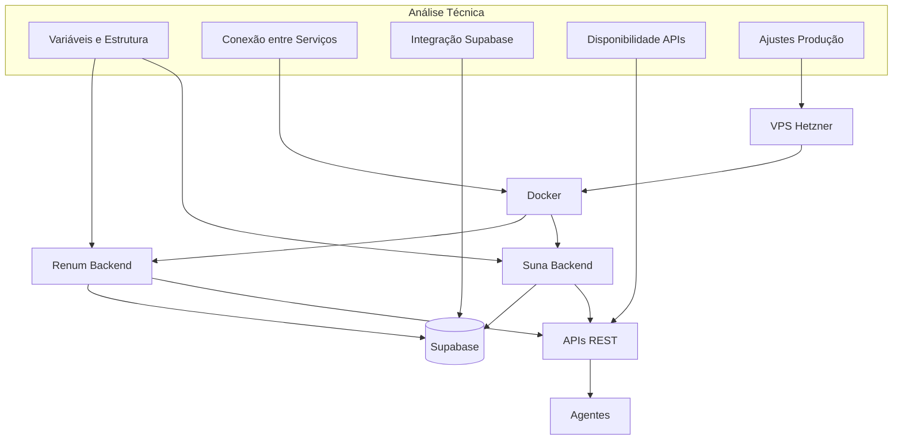

# Design Document

## Overview

Este documento descreve o design da análise técnica do ambiente Suna na VPS e sua compatibilidade com o backend Renum. A análise será estruturada em cinco áreas principais, conforme definido nos requisitos: variáveis de ambiente e estrutura, conexão entre serviços, integração com Supabase, disponibilidade de APIs e ajustes para produção.

## Arquitetura

A análise técnica será baseada na arquitetura atual do sistema, que consiste em:

1. **VPS Hetzner** (IP: 157.180.39.41) - Servidor onde os serviços estão hospedados
2. **Contêineres Docker** - Serviços Renum e Suna executados em contêineres
3. **Supabase** - Serviço de banco de dados PostgreSQL com funcionalidades adicionais
4. **APIs REST** - Interfaces de comunicação entre os serviços

A análise será realizada através de comandos SSH executados no servidor, verificação de logs, testes de conectividade e validação de configurações.

## Componentes e Interfaces

### 1. Análise de Variáveis de Ambiente e Estrutura

#### Componentes a serem analisados:
- Arquivos .env do Renum e Suna
- Estrutura de diretórios dos serviços
- Permissões de arquivos e diretórios
- Configurações Docker

#### Interfaces:
- Sistema de arquivos da VPS
- Docker Compose
- Configurações de contêineres

### 2. Análise de Conexão entre Serviços

#### Componentes a serem analisados:
- Configuração de rede Docker
- Comunicação entre contêineres
- Portas expostas e mapeamentos
- Logs de comunicação

#### Interfaces:
- Docker Network
- APIs de comunicação entre serviços
- Logs de serviços

### 3. Análise de Integração com Supabase

#### Componentes a serem analisados:
- Configuração de conexão com Supabase
- Certificados SSL
- Funções vetoriais no Supabase
- Permissões e roles no banco de dados

#### Interfaces:
- Cliente Supabase
- PostgreSQL
- pgvector

### 4. Análise de Disponibilidade de APIs

#### Componentes a serem analisados:
- Endpoints REST
- Autenticação e autorização
- Respostas e códigos de status
- Rate limiting e segurança

#### Interfaces:
- FastAPI (Renum)
- APIs do Suna
- Documentação Swagger/OpenAPI

### 5. Análise de Ajustes para Produção

#### Componentes a serem analisados:
- Configuração de logs
- Monitoramento e alertas
- Backup e recuperação
- Segurança e vulnerabilidades
- Performance e otimização

#### Interfaces:
- Sistema de logs
- Ferramentas de monitoramento
- Configurações de segurança

## Metodologia de Análise

### Coleta de Dados

A coleta de dados será realizada através de:

1. **Comandos SSH** - Execução de comandos no servidor para verificar configurações e logs
2. **Testes de API** - Verificação de endpoints e respostas
3. **Análise de Logs** - Verificação de logs de serviços para identificar problemas
4. **Verificação de Configurações** - Análise de arquivos de configuração e variáveis de ambiente

### Ferramentas de Análise

As seguintes ferramentas serão utilizadas:

1. **SSH** - Para acesso ao servidor
2. **Docker CLI** - Para gerenciamento e inspeção de contêineres
3. **curl/httpie** - Para testes de API
4. **jq** - Para processamento de JSON
5. **psql** - Para conexão direta com PostgreSQL
6. **grep/awk/sed** - Para análise de logs e arquivos de configuração

### Comandos de Análise

Para cada área de análise, serão utilizados comandos específicos:

#### 1. Variáveis de Ambiente e Estrutura
```bash
# Listar contêineres Docker
docker ps -a

# Verificar variáveis de ambiente de um contêiner
docker inspect -f '{{.Config.Env}}' [container_id]

# Verificar volumes e mounts
docker inspect -f '{{.Mounts}}' [container_id]

# Verificar estrutura de diretórios
find /path/to/service -type d | sort

# Verificar permissões
ls -la /path/to/service
```

#### 2. Conexão entre Serviços
```bash
# Verificar redes Docker
docker network ls
docker network inspect [network_name]

# Verificar comunicação entre contêineres
docker exec [container_id] ping [other_container]
docker exec [container_id] curl -v [other_container_service_url]

# Verificar logs de comunicação
docker logs [container_id] | grep -i error
docker logs [container_id] | grep -i connection
```

#### 3. Integração com Supabase
```bash
# Testar conexão com Supabase
docker exec [container_id] python -c "import os; from supabase import create_client; url=os.environ.get('SUPABASE_URL'); key=os.environ.get('SUPABASE_KEY'); client=create_client(url, key); print(client.table('some_table').select('*').limit(1).execute())"

# Verificar configuração SSL
docker exec [container_id] cat /path/to/ssl/config

# Verificar funções vetoriais
docker exec [container_id] psql -h [supabase_host] -U [supabase_user] -d [supabase_db] -c "SELECT * FROM pg_extension WHERE extname = 'vector';"
```

#### 4. Disponibilidade de APIs
```bash
# Testar endpoints
curl -v [api_endpoint]
curl -v -H "Authorization: Bearer [token]" [protected_api_endpoint]

# Verificar documentação OpenAPI
curl [api_endpoint]/docs/openapi.json | jq
```

#### 5. Ajustes para Produção
```bash
# Verificar configuração de logs
docker inspect -f '{{.LogPath}}' [container_id]
ls -la /var/lib/docker/containers/[container_id]/[container_id]-json.log

# Verificar uso de recursos
docker stats [container_id]
docker exec [container_id] top -bn1

# Verificar configuração de backup
crontab -l | grep backup
```

## Modelo de Dados

### Dados de Configuração

Os seguintes dados de configuração serão coletados e analisados:

1. **Variáveis de Ambiente**
   - SUPABASE_URL
   - SUPABASE_KEY
   - DATABASE_URL
   - API_KEYS
   - Outras variáveis específicas dos serviços

2. **Configurações de Rede**
   - IPs internos dos contêineres
   - Portas expostas
   - Mapeamentos de portas
   - Configurações de DNS

3. **Configurações de Banco de Dados**
   - Conexões
   - Schemas
   - Funções
   - Extensões

### Dados de Análise

Os seguintes dados serão gerados durante a análise:

1. **Relatório de Compatibilidade**
   - Status de cada componente (OK, Aviso, Erro)
   - Descrição de problemas encontrados
   - Recomendações de correção

2. **Logs de Teste**
   - Resultados de testes de API
   - Resultados de testes de conexão
   - Erros encontrados

3. **Métricas de Performance**
   - Uso de CPU
   - Uso de memória
   - Tempo de resposta de APIs

## Estratégia de Teste

### Testes de Conectividade

1. **Teste de Rede Docker**
   - Verificar comunicação entre contêineres
   - Verificar resolução de nomes
   - Verificar acesso a serviços externos

2. **Teste de Conexão com Supabase**
   - Verificar conexão SSL
   - Verificar autenticação
   - Verificar permissões

3. **Teste de APIs**
   - Verificar disponibilidade de endpoints
   - Verificar autenticação
   - Verificar respostas corretas

### Validação de Configuração

1. **Validação de Variáveis de Ambiente**
   - Verificar presença de todas as variáveis necessárias
   - Verificar valores corretos
   - Verificar consistência entre serviços

2. **Validação de Estrutura**
   - Verificar diretórios necessários
   - Verificar arquivos de configuração
   - Verificar permissões

3. **Validação de Logs**
   - Verificar configuração de logs
   - Verificar rotação de logs
   - Verificar níveis de log

## Relatório de Análise

O relatório final de análise será estruturado da seguinte forma:

1. **Resumo Executivo**
   - Status geral da compatibilidade
   - Principais problemas encontrados
   - Recomendações críticas

2. **Análise Detalhada**
   - Resultados por área de análise
   - Problemas encontrados
   - Evidências (logs, saídas de comandos)

3. **Recomendações**
   - Correções necessárias
   - Melhorias sugeridas
   - Priorização de ações

4. **Plano de Ação**
   - Passos para correção de problemas
   - Responsáveis
   - Prazos

## Diagrama de Arquitetura



## Considerações de Segurança

Durante a análise, serão observadas as seguintes considerações de segurança:

1. **Acesso SSH**
   - Utilizar chave SSH para autenticação
   - Não armazenar credenciais em texto plano
   - Limitar acesso a usuários autorizados

2. **Dados Sensíveis**
   - Não expor chaves de API ou tokens
   - Mascarar informações sensíveis em logs
   - Não compartilhar credenciais

3. **Testes de API**
   - Utilizar endpoints de teste quando possível
   - Não modificar dados de produção
   - Limitar volume de requisições

4. **Análise de Vulnerabilidades**
   - Verificar configurações de segurança
   - Identificar possíveis vulnerabilidades
   - Recomendar correções de segurança