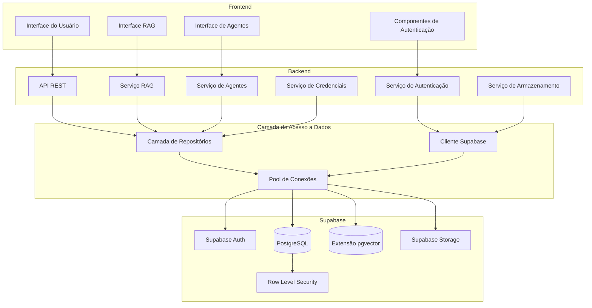
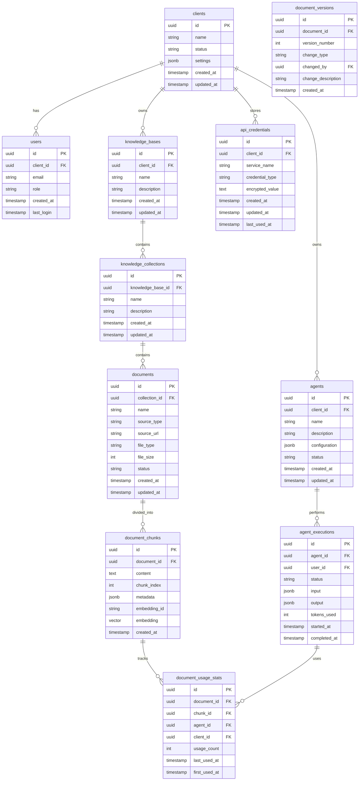

# Design da Integração Supabase com a Plataforma Renum

## Visão Geral

Este documento detalha o design técnico para a integração do Supabase com a Plataforma Renum, abrangendo todos os componentes do sistema que dependem do banco de dados. A integração vai além do módulo RAG, servindo como a camada de persistência para toda a plataforma, incluindo autenticação, gerenciamento de usuários, clientes, agentes, credenciais e armazenamento de arquivos.

## Arquitetura

A arquitetura da integração Supabase-Renum segue um modelo em camadas que separa as preocupações e facilita a manutenção e escalabilidade do sistema.

### Diagrama de Arquitetura



### Componentes Principais

1. **Cliente Supabase**: Wrapper centralizado para interação com o Supabase
2. **Camada de Repositórios**: Implementa o padrão Repository para acesso a dados
3. **Pool de Conexões**: Gerencia conexões eficientes com o Supabase
4. **Serviços de Domínio**: Implementam a lógica de negócios específica de cada área
5. **API REST**: Expõe endpoints para o frontend

## Estratégia de Conexão

Para garantir uma conexão robusta e eficiente com o Supabase, implementaremos as seguintes estratégias:

### Configuração de Conexão

```python
# Exemplo de configuração de conexão
import os
from supabase import create_client, Client
from dotenv import load_dotenv

# Carregar variáveis de ambiente
load_dotenv()

# Configurações do Supabase
SUPABASE_URL = os.getenv("SUPABASE_URL")
SUPABASE_KEY = os.getenv("SUPABASE_KEY")
SUPABASE_SERVICE_KEY = os.getenv("SUPABASE_SERVICE_KEY")
SUPABASE_DB_URL = os.getenv("SUPABASE_DB_URL")  # Para conexão direta com PostgreSQL

# Cliente Supabase para API REST
supabase: Client = create_client(SUPABASE_URL, SUPABASE_KEY)

# Cliente PostgreSQL para operações avançadas (opcional)
import psycopg2
from psycopg2.pool import ThreadedConnectionPool

# Pool de conexões PostgreSQL
min_conn = 1
max_conn = 10
pg_pool = ThreadedConnectionPool(min_conn, max_conn, SUPABASE_DB_URL)
```

### Variáveis de Ambiente Necessárias

```
SUPABASE_URL=https://uxxvoicxhkakpguvavba.supabase.co
SUPABASE_KEY=eyJhbGciOiJIUzI1NiIsInR5cCI6IkpXVCJ9...
SUPABASE_SERVICE_KEY=eyJhbGciOiJIUzI1NiIsInR5cCI6IkpXVCJ9...
SUPABASE_DB_URL=postgresql://postgres:<SENHA>@db.uxxvoicxhkakpguvavba.supabase.co:5432/postgres?sslmode=require
```

### Opções de Conexão

1. **Conexão Direta**: Para operações de longa duração
   - Host: db.uxxvoicxhkakpguvavba.supabase.co
   - Porta: 5432
   - SSL: Habilitado (sslmode=require)

2. **Transaction Pooler**: Para aplicações stateless (como serverless functions)
   - Host: aws-0-sa-east-1-pooler.supabase.com
   - Porta: 6543
   - Pool Mode: transaction

3. **Session Pooler**: Para conexões via IPv4
   - Host: aws-0-sa-east-1-pooler.supabase.com
   - Porta: 5432
   - Pool Mode: session

## Modelo de Dados

### Diagrama ER Simplificado



### Tabelas Principais

#### Sistema de Autenticação e Usuários
- **auth.users**: Gerenciada pelo Supabase Auth
- **clients**: Clientes da plataforma (organizações)
- **users**: Usuários associados a clientes

#### Módulo RAG
- **knowledge_bases**: Bases de conhecimento
- **knowledge_collections**: Coleções dentro das bases
- **documents**: Documentos nas coleções
- **document_chunks**: Chunks de documentos com embeddings
- **document_versions**: Histórico de versões de documentos
- **document_usage_stats**: Estatísticas de uso de documentos

#### Sistema de Agentes
- **agents**: Configuração de agentes
- **agent_executions**: Registro de execuções de agentes
- **api_credentials**: Credenciais de API criptografadas

## Implementação

### Camada de Repositório

Implementaremos o padrão Repository para abstrair o acesso ao banco de dados:

```python
from abc import ABC, abstractmethod
from typing import List, Dict, Any, Optional, TypeVar, Generic

T = TypeVar('T')

class Repository(Generic[T], ABC):
    """Interface base para repositórios."""
    
    @abstractmethod
    async def get_by_id(self, id: str) -> Optional[T]:
        """Recupera uma entidade pelo ID."""
        pass
    
    @abstractmethod
    async def list(self, filters: Dict[str, Any] = None, limit: int = 100, offset: int = 0) -> List[T]:
        """Lista entidades com filtros opcionais."""
        pass
    
    @abstractmethod
    async def create(self, entity: T) -> T:
        """Cria uma nova entidade."""
        pass
    
    @abstractmethod
    async def update(self, id: str, entity: T) -> T:
        """Atualiza uma entidade existente."""
        pass
    
    @abstractmethod
    async def delete(self, id: str) -> bool:
        """Exclui uma entidade pelo ID."""
        pass
```

### Implementação de Repositórios Específicos

```python
class KnowledgeBaseRepository(Repository[KnowledgeBase]):
    """Repositório para bases de conhecimento."""
    
    def __init__(self, supabase_client):
        self.supabase = supabase_client
    
    async def get_by_id(self, id: str) -> Optional[KnowledgeBase]:
        result = await self.supabase.from_("knowledge_bases").select("*").eq("id", id).execute()
        if result.data and len(result.data) > 0:
            return KnowledgeBase(**result.data[0])
        return None
    
    async def list(self, filters: Dict[str, Any] = None, limit: int = 100, offset: int = 0) -> List[KnowledgeBase]:
        query = self.supabase.from_("knowledge_bases").select("*").limit(limit).offset(offset)
        
        if filters:
            for key, value in filters.items():
                query = query.eq(key, value)
        
        result = await query.execute()
        return [KnowledgeBase(**item) for item in result.data]
    
    async def create(self, entity: KnowledgeBase) -> KnowledgeBase:
        result = await self.supabase.from_("knowledge_bases").insert(entity.dict()).execute()
        return KnowledgeBase(**result.data[0])
    
    async def update(self, id: str, entity: KnowledgeBase) -> KnowledgeBase:
        result = await self.supabase.from_("knowledge_bases").update(entity.dict()).eq("id", id).execute()
        return KnowledgeBase(**result.data[0])
    
    async def delete(self, id: str) -> bool:
        await self.supabase.from_("knowledge_bases").delete().eq("id", id).execute()
        return True
```

### Cliente Supabase Centralizado

```python
class SupabaseClient:
    """Cliente centralizado para o Supabase."""
    
    _instance = None
    
    @classmethod
    def get_instance(cls):
        """Implementação de Singleton para o cliente Supabase."""
        if cls._instance is None:
            cls._instance = cls()
        return cls._instance
    
    def __init__(self):
        """Inicializa o cliente Supabase."""
        self.url = os.getenv("SUPABASE_URL")
        self.key = os.getenv("SUPABASE_KEY")
        self.service_key = os.getenv("SUPABASE_SERVICE_KEY")
        self.db_url = os.getenv("SUPABASE_DB_URL")
        
        # Cliente para API REST
        self.client = create_client(self.url, self.key)
        
        # Cliente com chave de serviço para operações administrativas
        self.admin_client = create_client(self.url, self.service_key)
        
        # Pool de conexões PostgreSQL para operações avançadas
        self.pg_pool = ThreadedConnectionPool(1, 10, self.db_url)
    
    def get_client(self, use_admin=False):
        """Retorna o cliente Supabase apropriado."""
        return self.admin_client if use_admin else self.client
    
    def get_pg_connection(self):
        """Obtém uma conexão do pool PostgreSQL."""
        return self.pg_pool.getconn()
    
    def release_pg_connection(self, conn):
        """Devolve uma conexão ao pool."""
        self.pg_pool.putconn(conn)
```

### Serviço de Embeddings para RAG

```python
class EmbeddingService:
    """Serviço para gerenciar embeddings no Supabase Vector."""
    
    def __init__(self, supabase_client):
        self.supabase = supabase_client
    
    async def create_embeddings(self, chunks: List[Dict], document_id: str) -> List[str]:
        """Cria embeddings para uma lista de chunks e retorna os IDs."""
        embedding_ids = []
        
        for chunk in chunks:
            # Gerar embedding usando modelo de embedding
            embedding_vector = await self._generate_embedding(chunk["content"])
            
            # Inserir chunk com embedding no banco de dados
            result = await self.supabase.from_("document_chunks").insert({
                "document_id": document_id,
                "content": chunk["content"],
                "chunk_index": chunk["index"],
                "metadata": chunk.get("metadata", {}),
                "embedding": embedding_vector,
                "created_at": datetime.now().isoformat()
            }).execute()
            
            if result.data and len(result.data) > 0:
                embedding_ids.append(result.data[0]["id"])
        
        return embedding_ids
    
    async def _generate_embedding(self, text: str) -> List[float]:
        """Gera um embedding para o texto usando o modelo configurado."""
        # Implementação depende do modelo de embedding escolhido
        # Exemplo com OpenAI:
        response = await openai.Embedding.acreate(
            input=text,
            model="text-embedding-ada-002"
        )
        return response["data"][0]["embedding"]
    
    async def search_similar(self, query: str, collection_ids: List[str], top_k: int = 5) -> List[Dict]:
        """Busca chunks similares ao query."""
        # Gerar embedding para a consulta
        query_embedding = await self._generate_embedding(query)
        
        # Usar função SQL personalizada para busca por similaridade
        conn = self.supabase.get_pg_connection()
        try:
            with conn.cursor() as cur:
                cur.execute(
                    """
                    SELECT * FROM search_embeddings($1, $2, $3)
                    """,
                    (query_embedding, top_k, collection_ids)
                )
                results = cur.fetchall()
                return results
        finally:
            self.supabase.release_pg_connection(conn)
```

### Serviço de Autenticação

```python
class AuthService:
    """Serviço para autenticação e gerenciamento de usuários."""
    
    def __init__(self, supabase_client):
        self.supabase = supabase_client
    
    async def sign_up(self, email: str, password: str, user_data: Dict[str, Any]) -> Dict:
        """Registra um novo usuário."""
        # Registrar usuário no Supabase Auth
        auth_response = await self.supabase.auth.sign_up({
            "email": email,
            "password": password
        })
        
        # Adicionar dados adicionais do usuário
        if auth_response.user:
            user_id = auth_response.user.id
            await self.supabase.from_("users").insert({
                "id": user_id,
                "email": email,
                "client_id": user_data.get("client_id"),
                "role": user_data.get("role", "user"),
                "created_at": datetime.now().isoformat()
            }).execute()
        
        return auth_response
    
    async def sign_in(self, email: str, password: str) -> Dict:
        """Autentica um usuário existente."""
        auth_response = await self.supabase.auth.sign_in_with_password({
            "email": email,
            "password": password
        })
        
        # Atualizar last_login
        if auth_response.user:
            await self.supabase.from_("users").update({
                "last_login": datetime.now().isoformat()
            }).eq("id", auth_response.user.id).execute()
        
        return auth_response
    
    async def get_user(self, user_id: str) -> Dict:
        """Obtém informações detalhadas de um usuário."""
        result = await self.supabase.from_("users").select("*").eq("id", user_id).execute()
        if result.data and len(result.data) > 0:
            return result.data[0]
        return None
```

### Serviço de Credenciais Seguras

```python
from cryptography.fernet import Fernet

class CredentialService:
    """Serviço para gerenciar credenciais de API de forma segura."""
    
    def __init__(self, supabase_client):
        self.supabase = supabase_client
        # Chave de criptografia (deve ser armazenada de forma segura)
        self.key = os.getenv("ENCRYPTION_KEY").encode()
        self.cipher = Fernet(self.key)
    
    async def store_credential(self, client_id: str, service_name: str, credential_type: str, value: str) -> Dict:
        """Armazena uma credencial de forma segura."""
        # Criptografar o valor
        encrypted_value = self.cipher.encrypt(value.encode()).decode()
        
        # Armazenar no banco de dados
        result = await self.supabase.from_("api_credentials").insert({
            "client_id": client_id,
            "service_name": service_name,
            "credential_type": credential_type,
            "encrypted_value": encrypted_value,
            "created_at": datetime.now().isoformat(),
            "updated_at": datetime.now().isoformat()
        }).execute()
        
        return result.data[0] if result.data else None
    
    async def get_credential(self, client_id: str, service_name: str) -> str:
        """Recupera e descriptografa uma credencial."""
        result = await self.supabase.from_("api_credentials").select("*").eq("client_id", client_id).eq("service_name", service_name).execute()
        
        if result.data and len(result.data) > 0:
            credential = result.data[0]
            
            # Atualizar last_used_at
            await self.supabase.from_("api_credentials").update({
                "last_used_at": datetime.now().isoformat()
            }).eq("id", credential["id"]).execute()
            
            # Descriptografar o valor
            decrypted_value = self.cipher.decrypt(credential["encrypted_value"].encode()).decode()
            return decrypted_value
        
        return None
```

## Segurança e Isolamento de Dados

### Row Level Security (RLS)

Implementaremos políticas RLS no Supabase para garantir o isolamento de dados entre clientes:

```sql
-- Exemplo de política RLS para knowledge_bases
CREATE POLICY knowledge_bases_select ON knowledge_bases
    FOR SELECT
    USING (client_id = auth.uid());

CREATE POLICY knowledge_bases_insert ON knowledge_bases
    FOR INSERT
    WITH CHECK (client_id = auth.uid());

CREATE POLICY knowledge_bases_update ON knowledge_bases
    FOR UPDATE
    USING (client_id = auth.uid());

CREATE POLICY knowledge_bases_delete ON knowledge_bases
    FOR DELETE
    USING (client_id = auth.uid());
```

### Criptografia de Dados Sensíveis

Para dados sensíveis como credenciais de API, implementaremos criptografia em nível de aplicação:

1. Chave de criptografia armazenada em variável de ambiente
2. Algoritmo Fernet para criptografia simétrica
3. Dados criptografados antes de serem armazenados no banco
4. Descriptografia apenas quando necessário para uso

## Estratégias de Escalabilidade

### Conexões Eficientes

1. **Pool de Conexões**: Implementação de pool de conexões para reutilização eficiente
2. **Transaction Pooler**: Uso do pooler do Supabase para aplicações stateless
3. **Conexões Assíncronas**: Uso de bibliotecas assíncronas para maximizar throughput

### Otimização de Consultas

1. **Índices Apropriados**: Criação de índices para campos frequentemente consultados
2. **Paginação**: Implementação de paginação para conjuntos grandes de dados
3. **Consultas Otimizadas**: Seleção apenas dos campos necessários

### Caching

1. **Cache de Resultados**: Implementação de cache Redis para consultas frequentes
2. **Invalidação Inteligente**: Estratégias de invalidação baseadas em eventos
3. **Cache Distribuído**: Suporte a múltiplas instâncias da aplicação

## Monitoramento e Diagnóstico

### Logging

```python
import logging
from contextlib import contextmanager
import time

# Configurar logger
logging.basicConfig(level=logging.INFO)
logger = logging.getLogger("supabase-integration")

@contextmanager
def db_operation_timer(operation_name):
    """Context manager para medir o tempo de operações de banco de dados."""
    start_time = time.time()
    try:
        yield
    finally:
        elapsed_time = time.time() - start_time
        logger.info(f"Operation '{operation_name}' completed in {elapsed_time:.3f}s")

# Exemplo de uso
async def get_knowledge_base(kb_id):
    with db_operation_timer("get_knowledge_base"):
        result = await supabase.from_("knowledge_bases").select("*").eq("id", kb_id).execute()
        return result.data[0] if result.data else None
```

### Métricas de Performance

Implementaremos coleta de métricas para:

1. Tempo de resposta de consultas
2. Taxa de acertos/erros do cache
3. Número de conexões ativas
4. Uso de recursos (CPU, memória)
5. Tamanho do banco de dados

## Integração com MCP (Model Context Protocol)

Para permitir que agentes de IA interajam com o banco de dados de forma segura, implementaremos um servidor MCP para Supabase:

```python
class SupabaseMCPServer:
    """Servidor MCP para interação segura com o Supabase."""
    
    def __init__(self):
        self.supabase = SupabaseClient.get_instance()
    
    async def list_tables(self):
        """Lista todas as tabelas acessíveis."""
        try:
            # Usar a função SQL personalizada
            result = await self.supabase.get_client().rpc("list_tables").execute()
            return result.data
        except Exception as e:
            return {"error": str(e)}
    
    async def execute_query(self, query):
        """Executa uma consulta SQL segura."""
        try:
            # Usar a função SQL personalizada
            result = await self.supabase.get_client().rpc("exec_sql", {"sql": query}).execute()
            return result.data
        except Exception as e:
            return {"error": str(e)}
    
    async def list_columns(self, table_name):
        """Lista colunas de uma tabela."""
        try:
            query = f"""
            SELECT column_name, data_type, is_nullable 
            FROM information_schema.columns 
            WHERE table_name = '{table_name}'
            """
            result = await self.supabase.get_client().rpc("exec_sql", {"sql": query}).execute()
            return result.data
        except Exception as e:
            return {"error": str(e)}
```

## Plano de Implementação

A implementação seguirá estas etapas:

1. **Configuração Inicial**:
   - Configurar variáveis de ambiente
   - Habilitar SSL no Supabase
   - Criar funções SQL auxiliares

2. **Implementação da Camada Base**:
   - Cliente Supabase centralizado
   - Pool de conexões
   - Repositórios base

3. **Implementação do Módulo RAG**:
   - Repositórios específicos
   - Serviço de embeddings
   - Funções de busca semântica

4. **Implementação da Autenticação**:
   - Integração com Supabase Auth
   - Gerenciamento de usuários e clientes

5. **Implementação de Segurança**:
   - Políticas RLS
   - Criptografia de credenciais
   - Validação de permissões

6. **Implementação de Escalabilidade**:
   - Estratégias de caching
   - Otimização de consultas
   - Monitoramento de performance

7. **Integração com MCP**:
   - Servidor MCP para Supabase
   - Métodos seguros para interação com o banco

## Considerações Finais

### Desafios Potenciais

1. **Conexão Segura**: Garantir que a conexão com o Supabase seja segura e estável
2. **Escalabilidade**: Lidar com grandes volumes de dados e múltiplos usuários simultâneos
3. **Isolamento de Dados**: Garantir que dados de diferentes clientes estejam completamente isolados
4. **Performance**: Manter tempos de resposta baixos, especialmente para buscas semânticas

### Próximos Passos

1. Implementar e testar a conexão básica com o Supabase
2. Criar as tabelas e funções SQL necessárias
3. Implementar os repositórios base
4. Desenvolver e testar o módulo RAG
5. Expandir para outros componentes do sistema