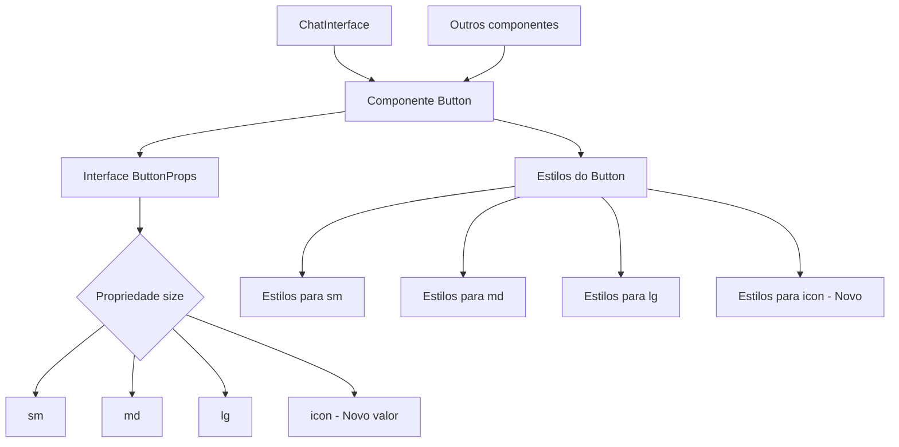

# Design Document

## Visão Geral

Este documento descreve o design para corrigir problemas nos componentes de UI do frontend Renum, com foco específico no erro de compilação relacionado ao componente Button e sua propriedade "size". O objetivo é garantir que todos os componentes de UI sigam um padrão consistente e não apresentem erros de compilação.

## Arquitetura

O frontend Renum é construído usando Next.js e React, com componentes de UI personalizados. A arquitetura atual inclui:

1. **Componentes de UI Base**: Componentes reutilizáveis como Button, Input, etc.
2. **Componentes de Interface**: Componentes que utilizam os componentes de UI base para criar interfaces mais complexas, como ChatInterface.
3. **Páginas**: Componentes de nível superior que representam rotas na aplicação.

## Componentes e Interfaces

### Componente Button

O componente Button atual aceita as seguintes propriedades:

```typescript
export interface ButtonProps extends ButtonHTMLAttributes<HTMLButtonElement> {
  variant?: 'primary' | 'secondary' | 'outline' | 'danger';
  size?: 'sm' | 'md' | 'lg';
  fullWidth?: boolean;
  isLoading?: boolean;
  leftIcon?: React.ReactNode;
  rightIcon?: React.ReactNode;
  children?: React.ReactNode;
}
```

O problema atual é que o componente Button está sendo usado com `size="icon"` em alguns lugares, mas a interface só aceita 'sm', 'md' ou 'lg' como valores válidos para a propriedade "size".

### Solução Proposta

Existem duas abordagens possíveis para resolver este problema:

1. **Atualizar o componente Button para aceitar "icon" como um valor válido para a propriedade "size"**:
   - Modificar a interface ButtonProps para incluir 'icon' como um valor válido
   - Adicionar estilos específicos para o tamanho 'icon'
   - Atualizar a lógica do componente para lidar com este novo valor

2. **Modificar os componentes que usam `size="icon"` para usar valores válidos**:
   - Identificar todos os componentes que usam `size="icon"`
   - Substituir por um valor válido (provavelmente 'sm')
   - Ajustar os estilos conforme necessário para manter a aparência visual

Considerando que o erro está ocorrendo no componente ChatInterface.tsx, mas a busca mostrou que há muitos outros componentes no projeto Suna que usam `size="icon"`, a primeira abordagem é mais adequada para manter a consistência com o projeto Suna.

## Modelo de Dados

Não há alterações no modelo de dados para esta correção.

## Tratamento de Erros

Após a implementação, devemos garantir que:
1. Não haja erros de compilação relacionados à propriedade "size" do componente Button
2. A aparência visual dos botões não seja afetada negativamente

## Estratégia de Teste

1. **Testes Unitários**:
   - Verificar se o componente Button aceita 'icon' como um valor válido para a propriedade "size"
   - Verificar se os estilos são aplicados corretamente para cada valor de "size"

2. **Testes Visuais**:
   - Verificar se a aparência dos botões com `size="icon"` é consistente em toda a aplicação
   - Verificar se a aparência dos botões não foi afetada negativamente pela mudança

3. **Testes de Integração**:
   - Verificar se a aplicação compila sem erros
   - Verificar se os componentes que usam o Button funcionam corretamente

## Diagrama

