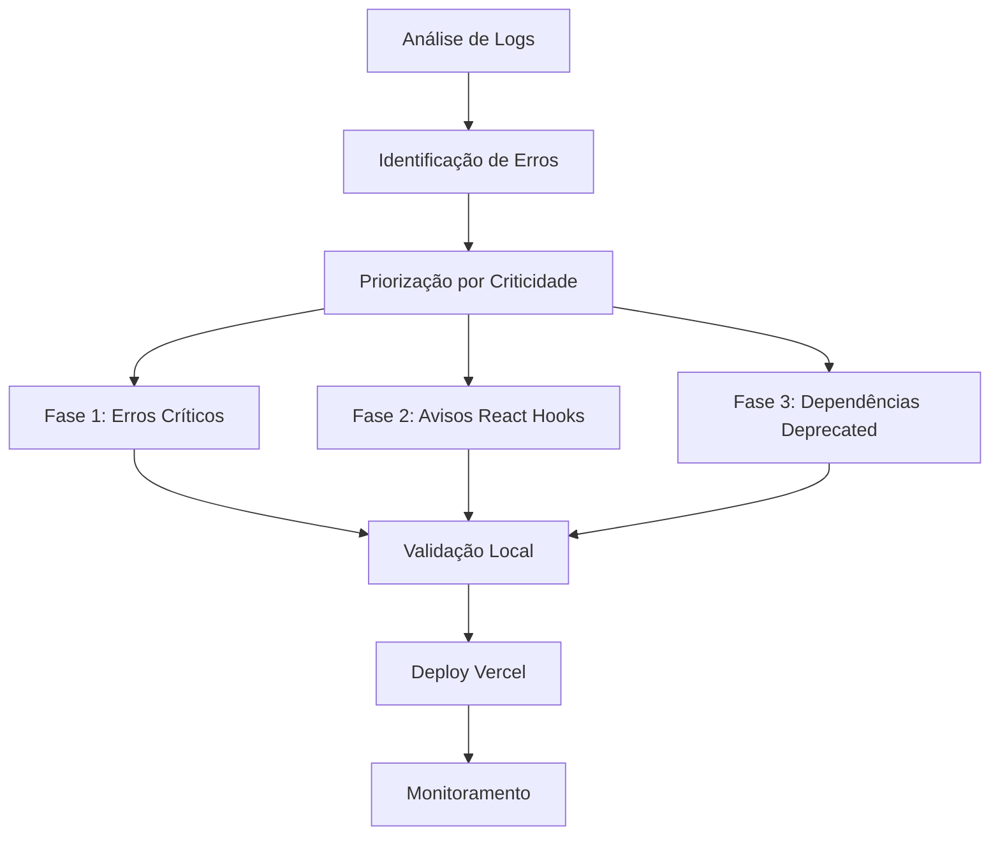

# Design Document - Correção de Erros de Deploy no Vercel

## Overview

Este documento apresenta o design técnico para resolver sistematicamente os erros de compilação TypeScript e avisos que impedem o deploy bem-sucedido no Vercel. A solução aborda quatro categorias principais: erros de importação, configuração de React Hooks, atualização de dependências e validação de build.

## Architecture

### Estratégia de Correção em Fases



### Hierarquia de Prioridades

1. **Crítico**: Erros que impedem compilação (Type errors)
2. **Alto**: Avisos de React Hooks que podem causar bugs
3. **Médio**: Dependências deprecated com impacto de segurança
4. **Baixo**: Avisos gerais de linting

## Components and Interfaces

### 1. Corretor de Importações (ImportFixer)

**Responsabilidade**: Resolver erros de importação de módulos TypeScript

**Arquivos Afetados**:
- `src/components/ShareAgentModal.tsx`
- `src/components/ToolSelector.tsx` 
- `src/components/ToolUsageDisplay.tsx`

**Estratégias de Correção**:

```typescript
// Estratégia 1: Verificar exportações existentes
// Antes:
import { apiClient } from '../lib/api-client';

// Depois (se apiClient não existe):
import { createApiClient } from '../lib/api-client';
const apiClient = createApiClient();

// Estratégia 2: Ajustar importações de ícones
// Antes:
import { Tool } from 'lucide-react';

// Depois:
import { Wrench as Tool } from 'lucide-react';
// ou
import { Settings as Tool } from 'lucide-react';

// Estratégia 3: Corrigir importações de tipos
// Antes:
import { ToolCall } from './ChatInterface';

// Depois:
import type { ToolCall } from './ChatInterface';
// ou
import ChatInterface, { type ToolCall } from './ChatInterface';
```

### 2. Corretor de React Hooks (HooksFixer)

**Responsabilidade**: Corrigir arrays de dependências em React Hooks

**Padrões de Correção**:

```typescript
// Padrão 1: useEffect com dependências faltantes
// Antes:
useEffect(() => {
  loadPreferences();
}, []); // Missing dependency: 'loadPreferences'

// Depois:
useEffect(() => {
  loadPreferences();
}, [loadPreferences]);

// Padrão 2: useCallback com dependências desnecessárias
// Antes:
const callback = useCallback(() => {
  doSomething();
}, [handleExecutionUpdate]); // Unnecessary dependency

// Depois:
const callback = useCallback(() => {
  doSomething();
}, []);

// Padrão 3: useMemo com dependências faltantes
// Antes:
const value = useMemo(() => ({
  publish,
  subscribe
}), []); // Missing dependencies: 'publish', 'subscribe'

// Depois:
const value = useMemo(() => ({
  publish,
  subscribe
}), [publish, subscribe]);
```

### 3. Atualizador de Dependências (DependencyUpdater)

**Responsabilidade**: Atualizar dependências deprecated para versões suportadas

**Mapeamento de Atualizações**:

```json
{
  "rimraf": {
    "from": "^3.0.2",
    "to": "^4.0.0",
    "breaking": true,
    "migration": "API changes in v4"
  },
  "glob": {
    "from": "^7.2.3", 
    "to": "^9.0.0",
    "breaking": true,
    "migration": "New async API"
  },
  "eslint": {
    "from": "^8.57.1",
    "to": "^9.0.0",
    "breaking": true,
    "migration": "Config format changes"
  },
  "@humanwhocodes/object-schema": {
    "from": "^2.0.3",
    "to": "@eslint/object-schema@^1.0.0",
    "replacement": true
  }
}
```

### 4. Validador de Build (BuildValidator)

**Responsabilidade**: Garantir consistência entre build local e Vercel

**Processo de Validação**:

```bash
# Script de validação local
#!/bin/bash
echo "🔍 Validando build local..."

# 1. Limpar cache
npm run clean
rm -rf .next node_modules/.cache

# 2. Instalar dependências
npm ci

# 3. Verificar tipos TypeScript
npx tsc --noEmit

# 4. Executar linting
npm run lint

# 5. Build de produção
npm run build

# 6. Verificar se build foi bem-sucedido
if [ $? -eq 0 ]; then
  echo "✅ Build local bem-sucedido"
else
  echo "❌ Build local falhou"
  exit 1
fi
```

## Data Models

### Estrutura de Erro

```typescript
interface BuildError {
  id: string;
  type: 'import' | 'hook' | 'dependency' | 'type';
  severity: 'critical' | 'high' | 'medium' | 'low';
  file: string;
  line: number;
  column: number;
  message: string;
  suggestion: string;
  fixed: boolean;
}

interface FixResult {
  errorId: string;
  success: boolean;
  changes: FileChange[];
  warnings: string[];
}

interface FileChange {
  file: string;
  type: 'import' | 'dependency' | 'hook';
  before: string;
  after: string;
  reason: string;
}
```

## Error Handling

### Estratégias de Recuperação

1. **Erros de Importação**:
   - Verificar se módulo existe
   - Sugerir importações alternativas
   - Criar módulos faltantes se necessário

2. **Erros de Hooks**:
   - Analisar dependências automaticamente
   - Sugerir correções baseadas em padrões
   - Validar se correção não causa loops infinitos

3. **Erros de Dependências**:
   - Verificar compatibilidade antes de atualizar
   - Manter backup de package-lock.json
   - Rollback automático em caso de falha

### Logging e Monitoramento

```typescript
interface FixLog {
  timestamp: Date;
  phase: 'import' | 'hooks' | 'dependencies' | 'validation';
  action: string;
  file?: string;
  success: boolean;
  error?: string;
  duration: number;
}
```

## Testing Strategy

### 1. Testes de Unidade

```typescript
describe('ImportFixer', () => {
  it('should fix missing apiClient import', () => {
    const result = fixImport('ShareAgentModal.tsx', 'apiClient');
    expect(result.success).toBe(true);
    expect(result.changes).toHaveLength(1);
  });
});

describe('HooksFixer', () => {
  it('should add missing useEffect dependencies', () => {
    const result = fixHookDependencies('NotificationSettings.tsx');
    expect(result.warnings).toHaveLength(0);
  });
});
```

### 2. Testes de Integração

```typescript
describe('Build Integration', () => {
  it('should build successfully after all fixes', async () => {
    await applyAllFixes();
    const buildResult = await runBuild();
    expect(buildResult.success).toBe(true);
    expect(buildResult.errors).toHaveLength(0);
  });
});
```

### 3. Testes de Regressão

```typescript
describe('Regression Tests', () => {
  it('should not break existing functionality', async () => {
    const beforeState = await captureAppState();
    await applyFixes();
    const afterState = await captureAppState();
    
    expect(afterState.functionalityBroken).toBe(false);
    expect(afterState.performanceRegression).toBe(false);
  });
});
```

### 4. Validação de Deploy

```yaml
# .github/workflows/deploy-validation.yml
name: Deploy Validation
on: [push, pull_request]

jobs:
  validate-build:
    runs-on: ubuntu-latest
    steps:
      - uses: actions/checkout@v3
      - name: Setup Node.js
        uses: actions/setup-node@v3
        with:
          node-version: '18'
      - name: Install dependencies
        run: npm ci
      - name: Type check
        run: npx tsc --noEmit
      - name: Lint
        run: npm run lint
      - name: Build
        run: npm run build
      - name: Simulate Vercel build
        run: npx vercel build --prod
```

## Implementation Plan

### Fase 1: Correções Críticas (Prioridade Máxima)
1. Corrigir erro de `apiClient` em `ShareAgentModal.tsx`
2. Corrigir erro de `showToast` em `ShareAgentModal.tsx`
3. Corrigir erro de `Tool` em `ToolSelector.tsx`
4. Corrigir erro de `ToolCall` em `ToolUsageDisplay.tsx`

### Fase 2: Correções de Hooks (Prioridade Alta)
1. Corrigir dependências em componentes WebSocket
2. Corrigir dependências em hooks customizados
3. Corrigir dependências em páginas

### Fase 3: Atualizações de Dependências (Prioridade Média)
1. Atualizar rimraf para v4
2. Atualizar glob para v9
3. Atualizar ESLint para versão suportada
4. Substituir pacotes deprecated

### Fase 4: Validação e Prevenção (Prioridade Baixa)
1. Implementar validação de build local
2. Configurar pre-commit hooks
3. Documentar padrões de código
4. Criar testes de regressão