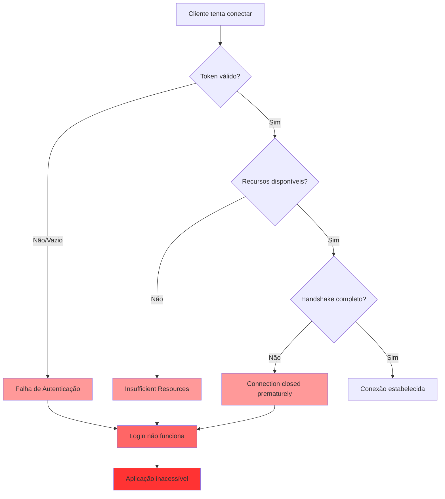
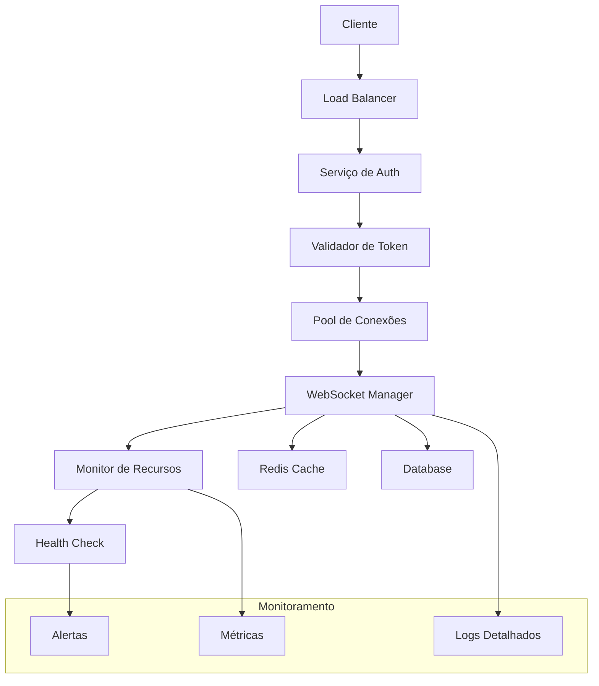

# Documento de Design - Correção Crítica de WebSocket

## Visão Geral

Este documento apresenta o design técnico para diagnosticar e resolver os problemas críticos de WebSocket que estão impactando a aplicação. A análise holística identifica quatro problemas principais interconectados: falhas por recursos insuficientes, conexões fechadas prematuramente, tokens de autenticação vazios e impacto na funcionalidade de login. A solução proposta aborda cada problema de forma sistemática e implementa melhorias de resiliência.

## Arquitetura

### Diagrama de Problemas Identificados



### Arquitetura da Solução



## Componentes e Interfaces

### 1. Diagnóstico de Problemas

#### TokenDiagnosticService

```python
class TokenDiagnosticService:
    async def validate_token_generation(self) -> DiagnosticResult:
        """Valida se tokens estão sendo gerados corretamente"""
        # Verifica configuração JWT
        # Testa geração de tokens
        # Valida formato e conteúdo
        
    async def check_token_transmission(self, request: Request) -> DiagnosticResult:
        """Verifica se tokens estão sendo transmitidos corretamente"""
        # Analisa headers de requisição
        # Verifica parâmetros de URL
        # Valida cookies de sessão
        
    async def diagnose_empty_tokens(self) -> List[TokenIssue]:
        """Identifica causas de tokens vazios"""
        # Verifica configuração de autenticação
        # Analisa fluxo de login
        # Identifica pontos de falha
```

#### ResourceDiagnosticService

```python
class ResourceDiagnosticService:
    async def check_connection_limits(self) -> ResourceStatus:
        """Verifica limites de conexão do sistema"""
        # Analisa configuração de WebSocket
        # Verifica limites do sistema operacional
        # Monitora uso atual de conexões
        
    async def analyze_memory_usage(self) -> MemoryAnalysis:
        """Analisa uso de memória por conexões WebSocket"""
        # Monitora consumo por conexão
        # Identifica vazamentos de memória
        # Calcula capacidade máxima
        
    async def check_network_resources(self) -> NetworkStatus:
        """Verifica recursos de rede disponíveis"""
        # Analisa largura de banda
        # Verifica latência de rede
        # Monitora throughput
```

#### ConnectionDiagnosticService

```python
class ConnectionDiagnosticService:
    async def analyze_handshake_failures(self) -> List[HandshakeIssue]:
        """Analisa falhas no handshake WebSocket"""
        # Monitora processo de handshake
        # Identifica pontos de falha
        # Analisa timing de conexões
        
    async def check_premature_closures(self) -> ClosureAnalysis:
        """Investiga conexões fechadas prematuramente"""
        # Analisa logs de desconexão
        # Identifica padrões de falha
        # Verifica timeouts
        
    async def validate_websocket_config(self) -> ConfigValidation:
        """Valida configuração de WebSocket"""
        # Verifica parâmetros de configuração
        # Testa compatibilidade de versões
        # Valida certificados SSL/TLS
```

### 2. Correções Implementadas

#### EnhancedWebSocketManager

```python
class EnhancedWebSocketManager:
    def __init__(self):
        self.connection_pool = ConnectionPool(max_size=1000)
        self.resource_monitor = ResourceMonitor()
        self.token_validator = TokenValidator()
        self.metrics_collector = MetricsCollector()
        
    async def connect_with_validation(self, websocket: WebSocket, token: str) -> ConnectionResult:
        """Conecta com validação completa"""
        # 1. Valida token antes da conexão
        if not await self.token_validator.validate(token):
            raise InvalidTokenError("Token inválido ou vazio")
            
        # 2. Verifica recursos disponíveis
        if not await self.resource_monitor.has_capacity():
            raise InsufficientResourcesError("Recursos insuficientes")
            
        # 3. Estabelece conexão com timeout
        try:
            connection = await asyncio.wait_for(
                self._establish_connection(websocket),
                timeout=30.0
            )
            return connection
        except asyncio.TimeoutError:
            raise ConnectionTimeoutError("Timeout no handshake")
            
    async def _establish_connection(self, websocket: WebSocket) -> Connection:
        """Estabelece conexão com retry automático"""
        max_retries = 3
        for attempt in range(max_retries):
            try:
                await websocket.accept()
                connection = Connection(websocket)
                await self.connection_pool.add(connection)
                self.metrics_collector.record_connection_success()
                return connection
            except Exception as e:
                if attempt == max_retries - 1:
                    self.metrics_collector.record_connection_failure(str(e))
                    raise
                await asyncio.sleep(2 ** attempt)  # Backoff exponencial
```

#### ImprovedTokenValidator

```python
class ImprovedTokenValidator:
    def __init__(self):
        self.jwt_secret = os.getenv("JWT_SECRET")
        self.token_cache = TTLCache(maxsize=10000, ttl=300)
        
    async def validate(self, token: str) -> ValidationResult:
        """Valida token com cache e logs detalhados"""
        if not token or token.strip() == "":
            logger.error("Token vazio recebido", extra={"token_length": len(token or "")})
            return ValidationResult(valid=False, reason="empty_token")
            
        # Verifica cache primeiro
        if token in self.token_cache:
            return self.token_cache[token]
            
        try:
            payload = jwt.decode(token, self.jwt_secret, algorithms=["HS256"])
            result = ValidationResult(valid=True, payload=payload)
            self.token_cache[token] = result
            return result
            
        except jwt.ExpiredSignatureError:
            logger.warning("Token expirado", extra={"token": token[:20] + "..."})
            return ValidationResult(valid=False, reason="expired")
            
        except jwt.InvalidTokenError as e:
            logger.error("Token inválido", extra={"error": str(e), "token": token[:20] + "..."})
            return ValidationResult(valid=False, reason="invalid")
```

#### ResourceMonitor

```python
class ResourceMonitor:
    def __init__(self):
        self.max_connections = int(os.getenv("MAX_WEBSOCKET_CONNECTIONS", "500"))
        self.memory_threshold = int(os.getenv("MEMORY_THRESHOLD_MB", "1024"))
        self.cpu_threshold = float(os.getenv("CPU_THRESHOLD", "80.0"))
        
    async def has_capacity(self) -> bool:
        """Verifica se há capacidade para nova conexão"""
        checks = await asyncio.gather(
            self._check_connection_limit(),
            self._check_memory_usage(),
            self._check_cpu_usage(),
            return_exceptions=True
        )
        
        return all(check for check in checks if not isinstance(check, Exception))
        
    async def _check_connection_limit(self) -> bool:
        """Verifica limite de conexões"""
        current_connections = await self._get_active_connections()
        available = current_connections < self.max_connections
        
        if not available:
            logger.warning(
                "Limite de conexões atingido",
                extra={
                    "current": current_connections,
                    "max": self.max_connections
                }
            )
        return available
        
    async def _check_memory_usage(self) -> bool:
        """Verifica uso de memória"""
        memory_mb = psutil.virtual_memory().used / 1024 / 1024
        available = memory_mb < self.memory_threshold
        
        if not available:
            logger.warning(
                "Limite de memória atingido",
                extra={
                    "current_mb": memory_mb,
                    "threshold_mb": self.memory_threshold
                }
            )
        return available
        
    async def _check_cpu_usage(self) -> bool:
        """Verifica uso de CPU"""
        cpu_percent = psutil.cpu_percent(interval=1)
        available = cpu_percent < self.cpu_threshold
        
        if not available:
            logger.warning(
                "Limite de CPU atingido",
                extra={
                    "current_percent": cpu_percent,
                    "threshold_percent": self.cpu_threshold
                }
            )
        return available
```

### 3. Frontend Resiliente

#### ResilientWebSocketService

```typescript
class ResilientWebSocketService {
    private socket: Socket | null = null;
    private reconnectAttempts = 0;
    private maxReconnectAttempts = 5;
    private reconnectDelay = 1000;
    private connectionState: 'disconnected' | 'connecting' | 'connected' | 'error' = 'disconnected';
    
    async connect(token: string): Promise<void> {
        if (!token || token.trim() === '') {
            throw new Error('Token de autenticação vazio ou inválido');
        }
        
        this.connectionState = 'connecting';
        
        try {
            this.socket = io(`${process.env.NEXT_PUBLIC_WS_URL}`, {
                auth: { token },
                timeout: 30000,
                transports: ['websocket', 'polling'], // Fallback para polling
                upgrade: true,
                rememberUpgrade: true
            });
            
            this.setupEventHandlers();
            await this.waitForConnection();
            
        } catch (error) {
            this.connectionState = 'error';
            this.handleConnectionError(error);
            throw error;
        }
    }
    
    private setupEventHandlers(): void {
        if (!this.socket) return;
        
        this.socket.on('connect', () => {
            console.log('WebSocket conectado com sucesso');
            this.connectionState = 'connected';
            this.reconnectAttempts = 0;
            this.reconnectDelay = 1000;
        });
        
        this.socket.on('disconnect', (reason) => {
            console.warn('WebSocket desconectado:', reason);
            this.connectionState = 'disconnected';
            
            if (reason === 'io server disconnect') {
                // Servidor forçou desconexão, não reconectar automaticamente
                return;
            }
            
            this.attemptReconnection();
        });
        
        this.socket.on('connect_error', (error) => {
            console.error('Erro de conexão WebSocket:', error);
            this.handleConnectionError(error);
        });
        
        this.socket.on('auth_error', (error) => {
            console.error('Erro de autenticação WebSocket:', error);
            this.connectionState = 'error';
            // Redirecionar para login se token inválido
            if (error.message.includes('token')) {
                window.location.href = '/login';
            }
        });
    }
    
    private async attemptReconnection(): Promise<void> {
        if (this.reconnectAttempts >= this.maxReconnectAttempts) {
            console.error('Máximo de tentativas de reconexão atingido');
            this.connectionState = 'error';
            return;
        }
        
        this.reconnectAttempts++;
        console.log(`Tentativa de reconexão ${this.reconnectAttempts}/${this.maxReconnectAttempts}`);
        
        await new Promise(resolve => setTimeout(resolve, this.reconnectDelay));
        
        try {
            if (this.socket) {
                this.socket.connect();
            }
        } catch (error) {
            console.error('Falha na reconexão:', error);
        }
        
        // Backoff exponencial
        this.reconnectDelay = Math.min(this.reconnectDelay * 2, 30000);
    }
    
    private handleConnectionError(error: any): void {
        if (error.message?.includes('insufficient resources')) {
            console.error('Recursos insuficientes no servidor');
            // Implementar fallback ou retry com delay maior
        } else if (error.message?.includes('timeout')) {
            console.error('Timeout na conexão WebSocket');
            // Retry com timeout maior
        } else if (error.message?.includes('auth')) {
            console.error('Erro de autenticação');
            // Redirecionar para login
        }
    }
    
    getConnectionState(): string {
        return this.connectionState;
    }
}
```

## Modelos de Dados

### DiagnosticResult

```typescript
interface DiagnosticResult {
    success: boolean;
    issues: Issue[];
    recommendations: string[];
    metrics: {
        response_time: number;
        resource_usage: ResourceUsage;
        error_count: number;
    };
}

interface Issue {
    type: 'token' | 'resource' | 'connection' | 'configuration';
    severity: 'low' | 'medium' | 'high' | 'critical';
    description: string;
    solution: string;
    affected_components: string[];
}
```

### ResourceUsage

```typescript
interface ResourceUsage {
    memory: {
        used_mb: number;
        available_mb: number;
        percentage: number;
    };
    cpu: {
        percentage: number;
        load_average: number[];
    };
    connections: {
        active: number;
        max_allowed: number;
        percentage: number;
    };
    network: {
        bandwidth_usage: number;
        latency_ms: number;
        packet_loss: number;
    };
}
```

## Tratamento de Erros

### Estratégias de Recuperação

1. **Token Vazio/Inválido**
   - Detecção precoce no cliente
   - Renovação automática de token
   - Redirecionamento para login se necessário
   - Cache de tokens válidos

2. **Recursos Insuficientes**
   - Monitoramento proativo de recursos
   - Implementação de circuit breaker
   - Fallback para polling HTTP
   - Balanceamento de carga

3. **Conexões Fechadas Prematuramente**
   - Retry com backoff exponencial
   - Timeout configurável
   - Heartbeat para detectar conexões mortas
   - Graceful degradation

### Logs e Monitoramento

```python
# Configuração de logs estruturados
LOGGING_CONFIG = {
    'version': 1,
    'disable_existing_loggers': False,
    'formatters': {
        'detailed': {
            'format': '%(asctime)s - %(name)s - %(levelname)s - %(message)s - %(extra)s'
        }
    },
    'handlers': {
        'websocket_file': {
            'class': 'logging.handlers.RotatingFileHandler',
            'filename': 'logs/websocket.log',
            'maxBytes': 10485760,  # 10MB
            'backupCount': 5,
            'formatter': 'detailed'
        }
    },
    'loggers': {
        'websocket': {
            'handlers': ['websocket_file'],
            'level': 'DEBUG',
            'propagate': False
        }
    }
}
```

## Estratégia de Teste

### Testes de Diagnóstico

1. **Simulação de Problemas**
   - Teste com tokens vazios/inválidos
   - Simulação de esgotamento de recursos
   - Teste de interrupção de handshake
   - Cenários de alta concorrência

2. **Validação de Correções**
   - Teste de reconexão automática
   - Validação de fallbacks
   - Teste de monitoramento de recursos
   - Verificação de logs detalhados

### Testes de Carga

```python
# Teste de carga para WebSocket
async def load_test_websocket():
    concurrent_connections = 1000
    tasks = []
    
    for i in range(concurrent_connections):
        task = asyncio.create_task(
            simulate_websocket_connection(f"user_{i}")
        )
        tasks.append(task)
    
    results = await asyncio.gather(*tasks, return_exceptions=True)
    
    # Análise de resultados
    successful = sum(1 for r in results if not isinstance(r, Exception))
    failed = len(results) - successful
    
    print(f"Conexões bem-sucedidas: {successful}")
    print(f"Conexões falhadas: {failed}")
    print(f"Taxa de sucesso: {successful/len(results)*100:.2f}%")
```

## Estratégia de Implantação

### Fase 1: Diagnóstico Imediato (1-2 dias)
- Implementar ferramentas de diagnóstico
- Executar análise completa dos problemas
- Identificar causas raiz específicas
- Gerar relatório detalhado

### Fase 2: Correções Críticas (2-3 dias)
- Implementar correções para tokens vazios
- Otimizar gerenciamento de recursos
- Melhorar processo de handshake
- Implementar monitoramento básico

### Fase 3: Melhorias de Resiliência (3-5 dias)
- Implementar reconexão automática
- Adicionar fallbacks graceful
- Melhorar logs e monitoramento
- Testes de carga e validação

### Fase 4: Monitoramento e Otimização (Contínuo)
- Dashboard de métricas em tempo real
- Alertas proativos
- Otimizações baseadas em dados
- Documentação e treinamento